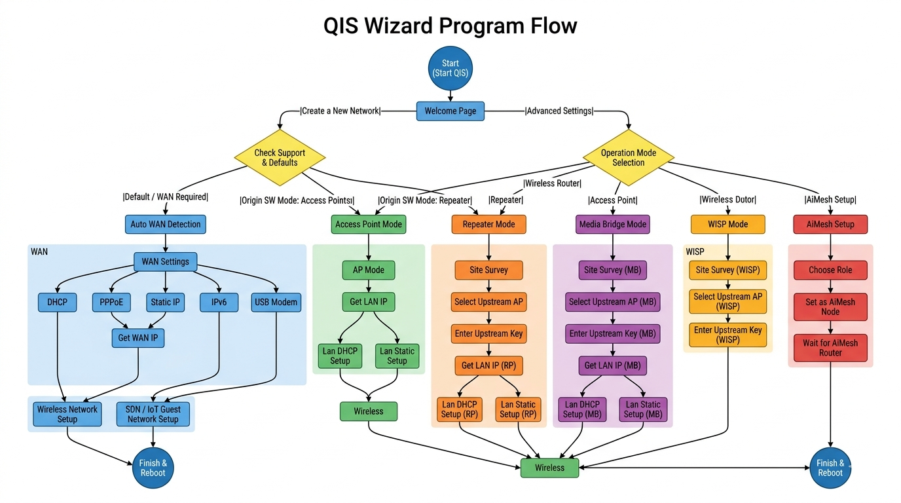
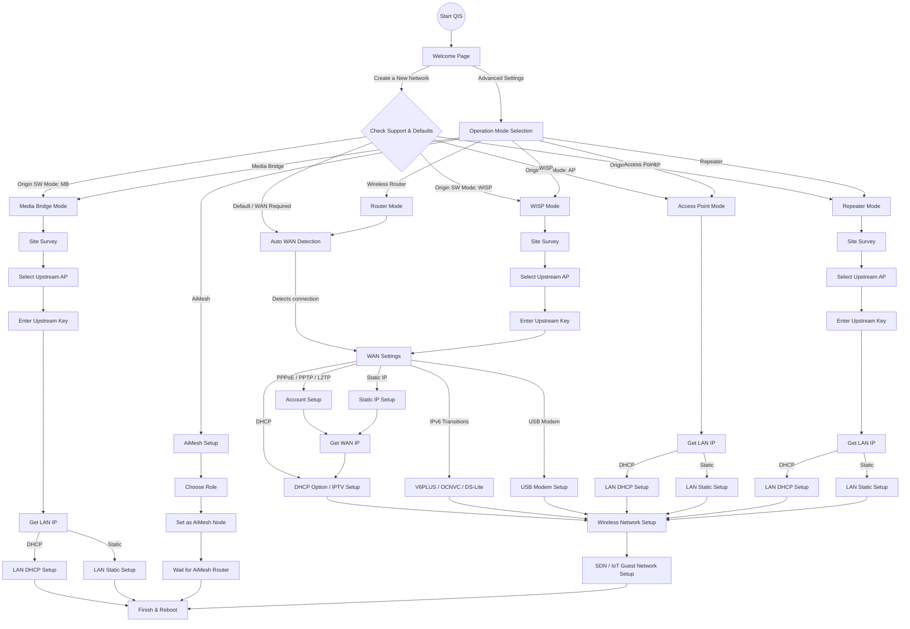
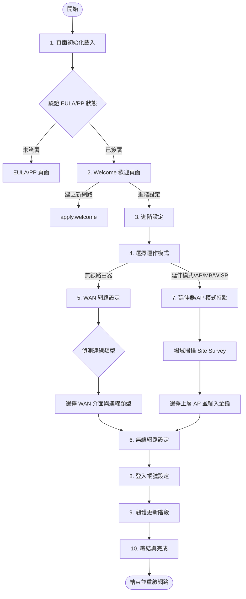

# QIS Wizard Program Flow & Architecture

這個文件整合了 QIS Wizard 的完整執行流程，包括結構圖、階段拆解，以及 `QIS_wizard.htm` 中的 JavaScript 執行邏輯與核心函數對照。

## 1. 流程圖表 (FlowCharts)

### 總體路由與功能分支 (Program Flow)

### 階段性執行流程 (Stage-Based Execution Flow)

此流程專注於前端各階段的切換與狀態流轉。

---

## 2. 階段詳細解說與函數對照 (Function Execution Flow)

本章節詳細記錄 `QIS_wizard.htm` 各階段對應執行的核心 JavaScript 函數。

### 核心階段與函數對照總表

| 階段 | 核心實作函數 (apply / goTo) | 說明 |
| :--- | :--- | :--- |
| **1. 初始化載入** | `PolicyStatus()`, `httpApi.nvramGet()` | 處理 EULA/PP 驗證與環境變數獲取。 |
| **2. 歡迎頁面** | `apply.welcome()`, `goTo.advSetting()` | 決定是走預設流程還是進入手動設定。 |
| **3. 進階設定** | `apply.changeOpMode()`, `apply.upload()` | 決定是否進入手動模式選擇或上傳設定檔。 |
| **4. 模式選擇** | `apply.changeOpMode()`, `goTo.rtMode()` 等 | 切換 `sw_mode` 並進入對應的分支。 |
| **5. WAN 設定** | `apply.WAN1G()`, `goTo.DHCP()`, `apply.pppoe()` | 處理自動偵測、PPPoE 撥號與靜態 IP 等配置。 |
| **6. 無線網路** | `apply.wireless()` | 設定各頻段 SSID、加密方式與密碼。 |
| **7. 掃描延伸器** | `goTo.siteSurvey()`, `apply.wlcKey()` | 執行 Site Survey 並連線至上層 AP。 |
| **8. 管理帳號** | `apply.login()`, `chkPass()` | 設定設備登入憑證並進行密碼強度檢查。 |
| **9. 韌體更新** | `apply.update()` | 檢查並執行線上韌體更新。 |
| **10. 完成重啟** | `goTo.leaveQIS()` | 寫入最終 NVRAM 並重啟網路服務。 |

---

### 各階段深入解析

#### 1. Initial Page Load (頁面初始化載入)
當載入 `QIS_wizard.htm` 時，會觸發 document ready 事件並開始執行初始化流程：
- `$(document).ready(...)`：程式進入點。
- `Check_Https_Redirect_Status()` 與 `Initial_Https_Redirect()`：在繼續前檢查是否需要進行 HTTPS 重新導向。
- `httpApi.nvramGet(...)`：獲取多個系統變數，如運作模式 (`sw_mode`)、雙 WAN 設定、出廠預設狀態、產品 ID 等。
- `PolicyStatus()`：驗證終端使用者授權協定 (EULA) 和隱私權政策 (PP)。根據路由器的狀態和網址的 `flag` 參數，它會將頁面重新導向到適當的函數。

#### 2. Welcome Stage (歡迎頁面 `#welcome`)
- **建立新網路 (預設):** `apply.welcome()`
- **進階設定:** `goTo.advSetting()`
- **無線路由器模式 (直接導向):** `apply.welcome_rt()`
- **WISP 模式 (直接導向):** `apply.welcome_wisp()`
- **完成/離開:** `goTo.Finish()`

#### 3. Advanced Settings (進階設定 `#advanced_setting`)
- **選擇運作模式:** `apply.changeOpMode()` -> 觸發轉換至 `#opMode_page`
- **AiMesh 節點設定:** `goTo.asNode()`
- **上傳設定檔:** `apply.upload()`
- **返回上一頁:** `abort.advSetting()`

#### 4. Operation Mode Selection (選擇運作模式 `#opMode_page`)
- **無線路由器 (Wireless Router):** `goTo.rtMode()`
- **中繼模式 (Repeater):** `goTo.rpMode()`
- **無線存取點 (AP):** `goTo.apMode()`
- **媒體橋接 (Media Bridge):** `goTo.mbMode()`
- **AiMesh:** `goTo.amasIntro()`
- **WISP 模式:** `goTo.wispMode()`
- **返回上一頁:** `abort.opMode()`

#### 5. Internet / WAN Setup Stage (網際網路 / WAN 設定)
- **等待/偵測中:** 頁面 `#waiting_page` 或 `#waiting_dsl_page` (手動設定備用方案: `apply.manual()` 或 `goTo.Manual()`)
- **選擇 WAN 介面 (`#wanOption_setting`):** `apply.WAN1G()`, `apply.WAN2p5G()`, `apply.WAN10G()`, `apply.WANModem()`
- **選擇連線類型 (`#wan_setting`):** `goTo.DHCP()`, `goTo.PPPoE()`, `goTo.Static()`, `goTo.V6PLUS()` 等等。
- **特殊 ISP 需求 (`#special_isp_requirement`):** `goTo.IPTV()` 或 `goTo.wirelessWithoutIPTV()`
- **套用連線設定:** `apply.pppoe()`, `apply.static()`, `apply.iptv()`, `apply.modem()` (以及對應的 `abort.*` 放棄方法)。

#### 6. Wireless Network Setup Stage (無線網路設定 `#wireless_setting`)
- **設定 SSID 與密碼:** 透過 `apply.wireless()` 處理
- **返回上一頁:** `abort.wireless()`

#### 7. Repeater / Media Bridge / WISP Mode Specifics (延伸模式特定功能)
- **場域掃描頁面 (`#siteSurvey_page`):** `goTo.siteSurvey()` / `abort.siteSurvey()`
- **AP 列表頁面 (`#papList_page`):** `sortAP(type, order)`, `goTo.wlcManual()`, `abort.papList()`
- **輸入無線金鑰 (`#wlcKey_setting`):** `apply.wlcKey()` / `abort.wlcKey()`

#### 8. Login Setup (管理帳號設定 `#login_name`)
- **送出登入憑證:** `apply.login()`
- **驗證機制:** 透過 `chkPass()` 與 `check_password_length()` 驗證密碼強度
- **返回上一頁:** `abort.login()`

#### 9. Firmware Update Stage (韌體更新階段 `#update_page`)
- **執行更新:** `apply.update()`
- **取消/略過更新:** `abort.update()`

#### 10. Finish / Summary Stage (完成與總結 `#summary_page`)
- **總結頁面 (`#summary_page`):** 顯示已設定的網路資訊。
- **完成並重啟:** `goTo.leaveQIS()` (負責關閉 QIS 會話並觸發重啟或重新導向至主控台儀表板)。

## Generic Navigation & Navigation Aborts (通用導航與放棄操作)

在整個流程中，以下模式決定了頁面的流轉：
- `apply.*()`：驗證當前頁面的輸入，將變數寫入資料模型 (`qisData.js`)，並使用 UI 轉換函數以程式化方式導向至下一個合適的頁面。
- `goTo.*()`：直接的結構轉換，將使用者從一個 QIS 頁面/區塊移動到另一個 (例如：隱藏 `#welcome` 並顯示 `#wireless_setting`)。
- `abort.*()`：負責處理返回前一個訪問狀態的邏輯，或捨棄當前頁面的部分設定。