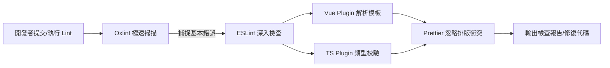
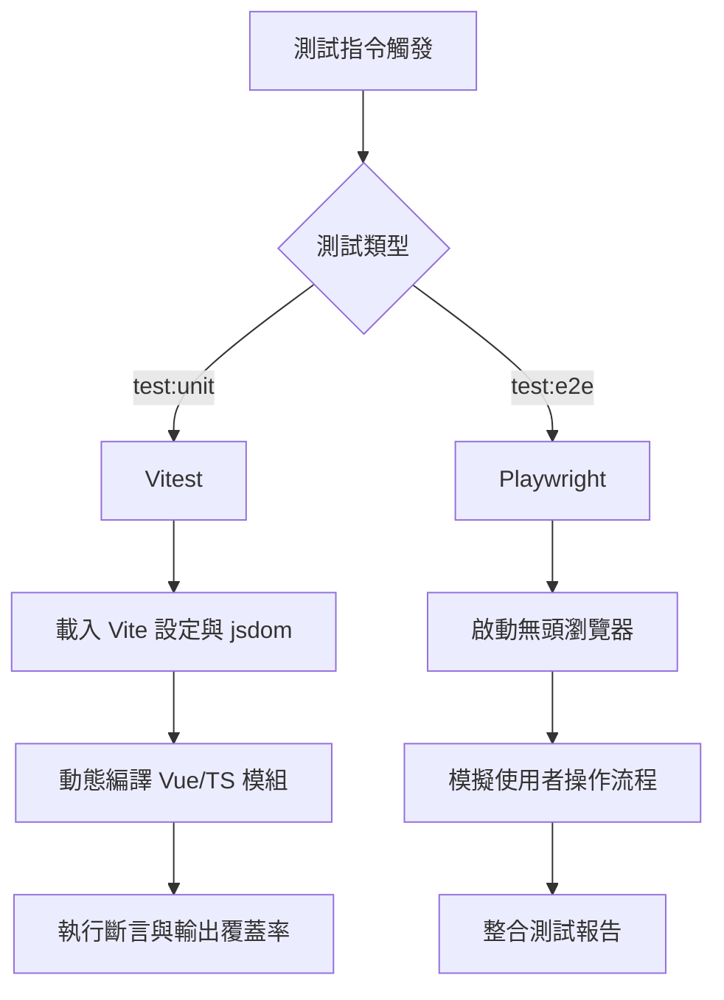

# Vite 核心工作方式分析報告

在現代前端工程中，Vite 已成為提速開發與構建的核心樞紐。本報告針對 `vue3-wrt-project` 中 Vite 的打包機制、ESLint 檢查流程、以及測試執行（Vitest / Playwright）的運作原理進行深度剖析。

## 1. Vite 的打包工作 (Build & Bundling)

Vite 採用「雙引擎」架構：開發階段利用 esbuild 與瀏覽器原生 ESM 提供極速冷啟動與 HMR；生產打包階段則交由 **Rollup** 進行高度優化的構建。

### 1.1 打包運作機制
- **預構建 (Pre-bundling)**: 在開發期，Vite 使用 esbuild 將 CommonJS 依賴轉為 ESM，並將零散的內部模組打包，減少請求數。
- **生產構建 (Production Build)**: 執行 `vite build` 時，Rollup 會進行 Tree-shaking（搖樹優化）、代碼壓縮、CSS 提取等作業，輸出高度優化的靜態資源。

### 1.2 檔案分割與優化策略 (Code Splitting)
在 `apps/web/vite.config.ts` 中，專案深度客製化了 `rollupOptions.output.manualChunks`，優化瀏覽器快取策略：
1. **第三方依賴 (Vendor Chunks)**:
   - `vendor-quasar`: 獨立打包 Quasar 元件庫。
   - `vendor-vue-ecosystem`: 將 Vue 核心、Vue Router、Pinia、Vue I18n 捆綁在一起。
   - `vendor-axios`: 獨立拆分 Axios。
2. **業務邏輯分割**:
   - `views-qis`: 所有 `/views/QIS/` 目錄下的引導頁面合併成單一 Chunk。
   - `views-main`: 其餘主要頁面合併，確保核心功能快速載入。
3. **語系檔 (Locales)**: 將非靜態字典檔的語系包集中打包，以利異步載入。

### 1.3 構建流程圖
```mermaid
graph TD;
    A[源代碼 (Vue/TS/SCSS)] --> B{Vite Build};
    B -->|ESM 解析| C[Rollup 打包];
    C --> D[Tree-shaking 剔除無用代碼];
    C --> E[Code Splitting 檔案分割];
    E --> F[Vendor Chunks];
    E --> G[Views Chunks];
    E --> H[Locales & Assets];
    D --> I[代碼壓縮 (Terser/esbuild)];
    F --> I;
    G --> I;
    H --> I;
    I --> J[輸出 /dist 靜態資源];
```

---

## 2. ESLint 檢查運作原理

專案採用了最新的 **ESLint Flat Config** 搭配 **Oxlint** 來兼顧「檢查準確度」與「執行速度」。

### 2.1 檢查流程
- **雙重檢查機制**: 根目錄 `package.json` 中的 `lint` 指令透過 `npm-run-all2` 依序執行：
  1. `lint:oxlint` (基於 Rust 的極速 Linter，瞬間掃描基礎語法錯誤)
  2. `lint:eslint` (深入執行 Vue 模板檢查、TypeScript 類型檢查與格式化規則)
- **Vite/TypeScript 整合**: 使用 `eslint.config.ts`，結合了 `@vue/eslint-config-typescript` 與 `eslint-plugin-vue`，確保 `<script setup>` 語法能被正確校驗。同時引入 Prettier `skipFormatting` 確保 ESLint 不與代碼格式化衝突。

### 2.2 流程圖


---

## 3. 測試執行運作原理 (Vitest & Playwright)

為了保證代碼品質，專案選用了與 Vite 深度整合的 **Vitest** 作為單元測試框架，並輔以 **Playwright** 進行 E2E 測試。

### 3.1 單元測試 (Vitest)
- **與 Vite 共享配置**: 在 `packages/shared/vitest.config.ts` 中，Vitest 直接復用了 Vite 的配置（如 `alias`, `plugins`），這意味著開發環境與測試環境的編譯行為完全一致。
- **極速 HMR 測試**: 由於底層基於 Vite，Vitest 具備極速的熱更新能力。修改組件或測試檔後，僅重新執行受影響的測試案例。
- **DOM 模擬**: 透過 `jsdom` 環境，讓 Vue 組件能在 Node.js 環境中進行掛載與斷言 (`@vue/test-utils`)。

### 3.2 端到端測試 (Playwright)
- 模擬真實瀏覽器行為，執行於 `e2e/` 目錄。不受限於 Vite，從外部對打包後的產物或 Dev Server 進行完整流程的黑箱測試。

### 3.3 測試流程圖
