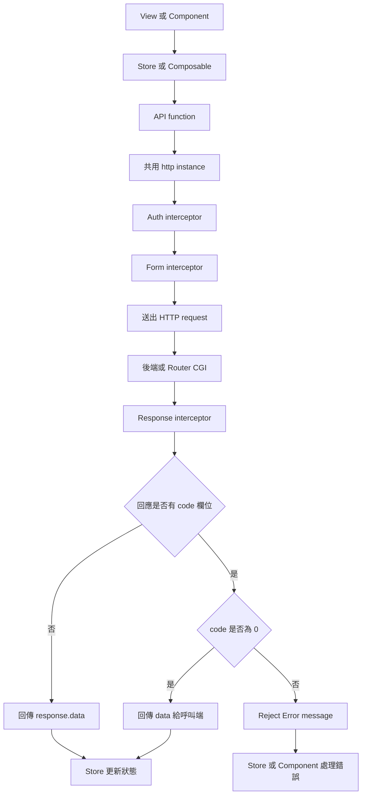
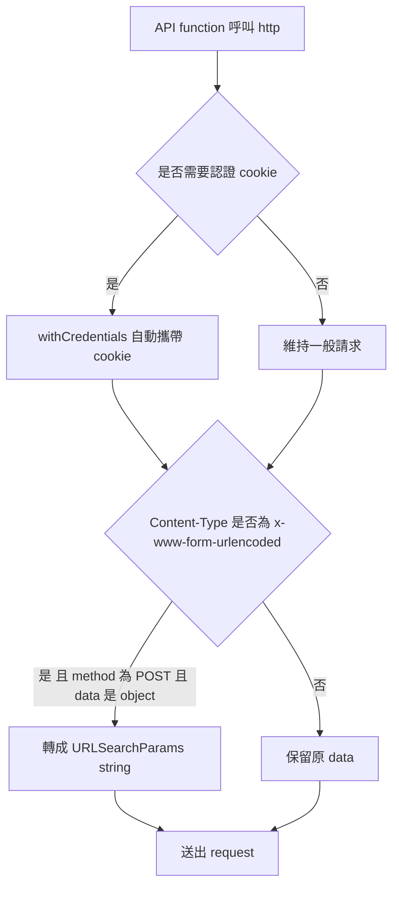
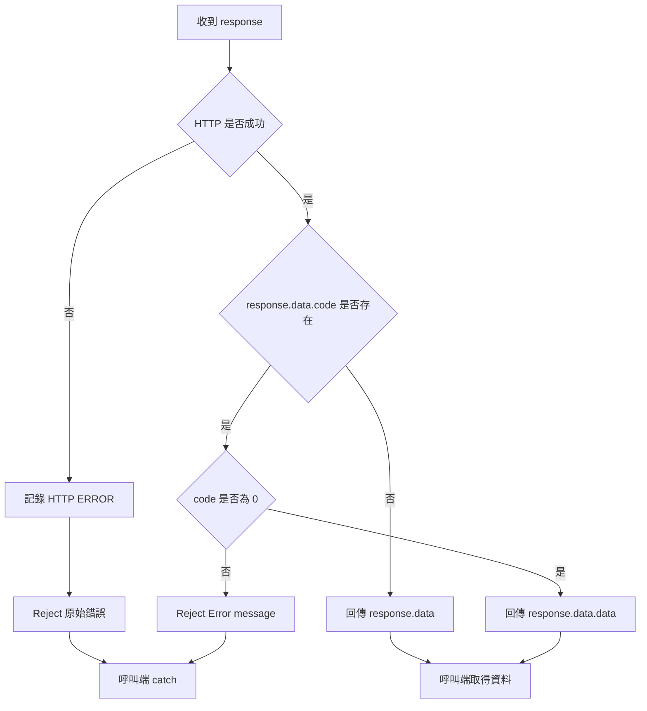
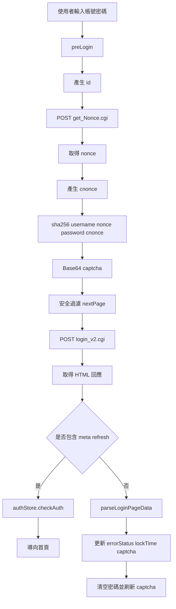
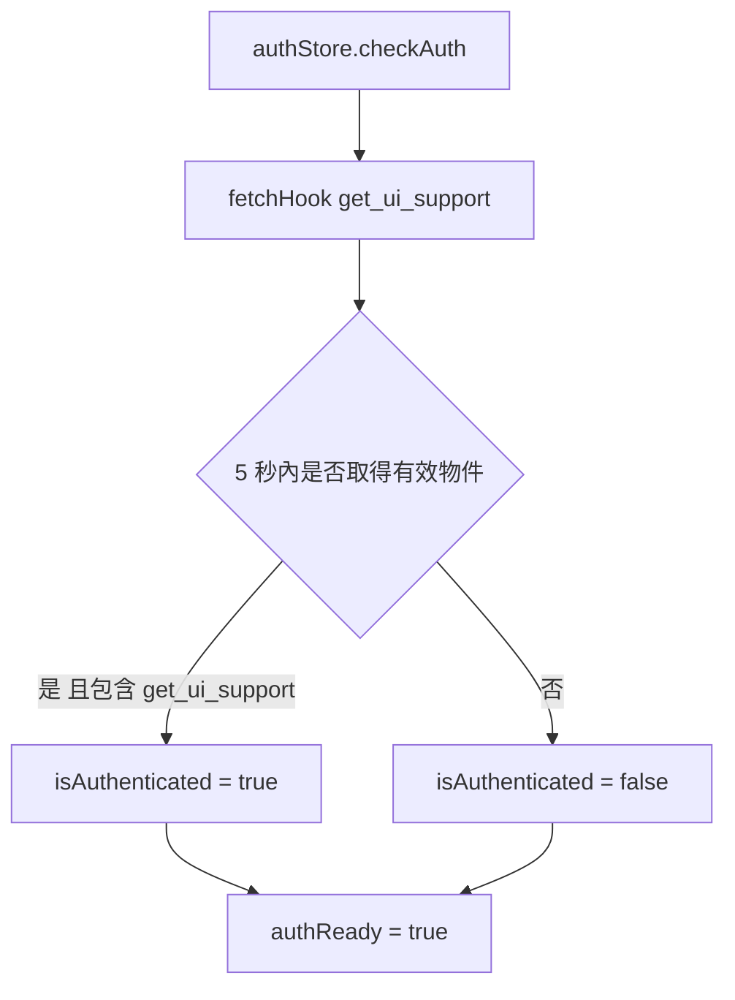
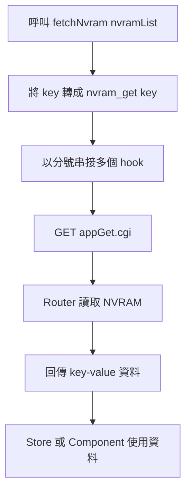
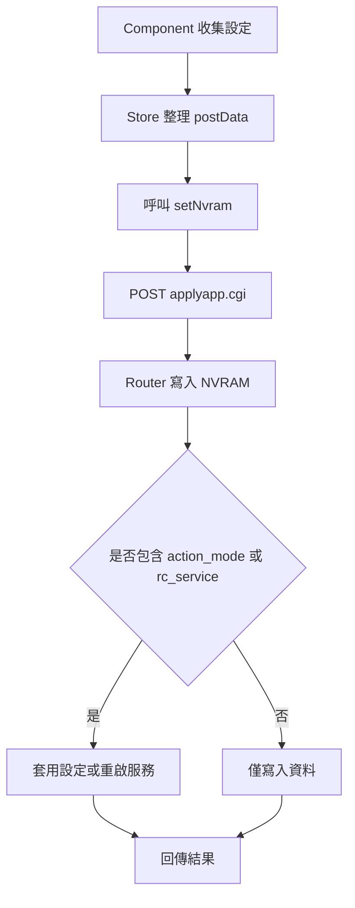
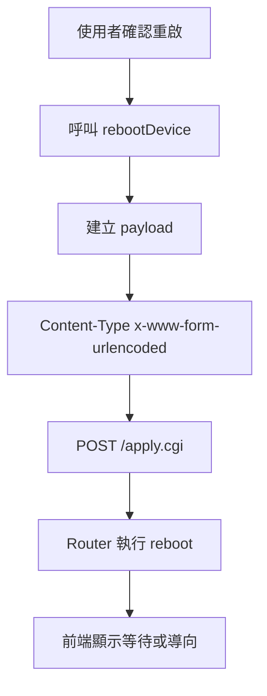
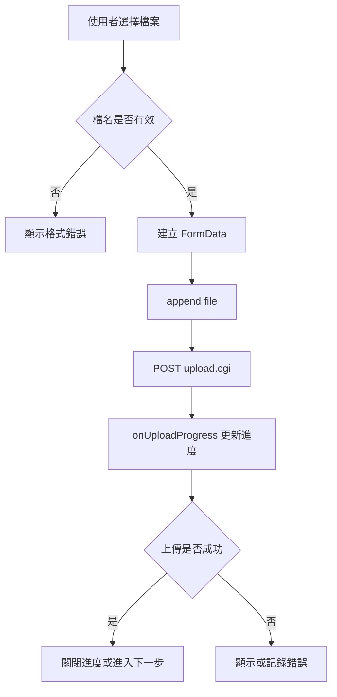
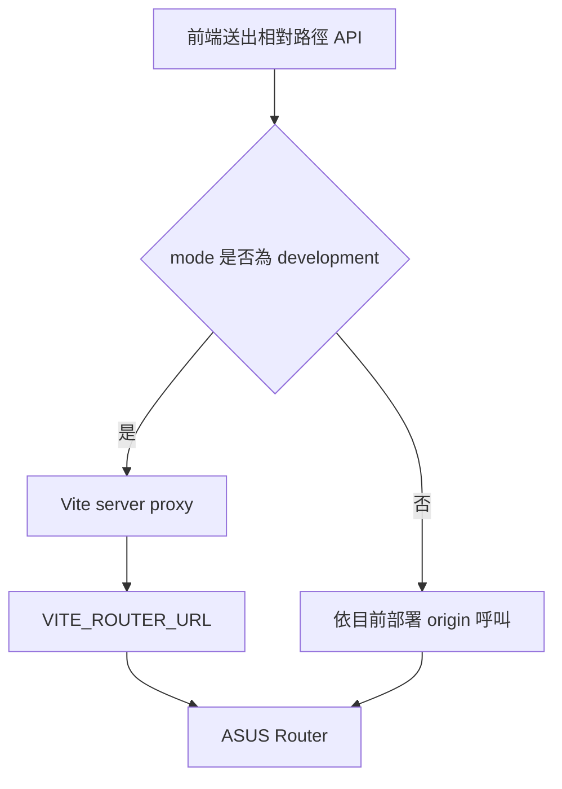

# API 運作流程圖

本文件以流程圖描述前端 API 呼叫、回應解包、錯誤處理、登入、NVRAM/Hook 與檔案上傳流程。

## 1. 一般 API 呼叫流程



## 2. Request 前處理流程



## 3. Response 與錯誤處理流程



## 4. v2 登入流程



## 5. 認證狀態檢查流程



## 6. Hook API 流程

```mermaid
flowchart TD
    A[呼叫 fetchHook hookName] --> B[組合 hookName()]
    B --> C[GET appGet.cgi]
    C --> D[Query hook=hookName()]
    D --> E[Router 執行 hook function]
    E --> F[回傳 hook 結果]
    F --> G[呼叫端以泛型解析資料]
```

## 7. NVRAM 讀取流程



## 8. NVRAM 寫入與套用流程



## 9. 裝置重啟流程



## 10. 檔案上傳流程



## 11. 開發模式 Proxy 流程


