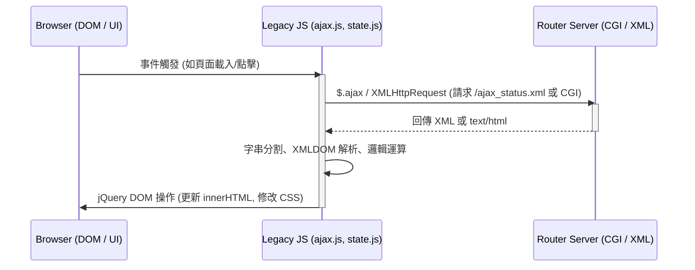
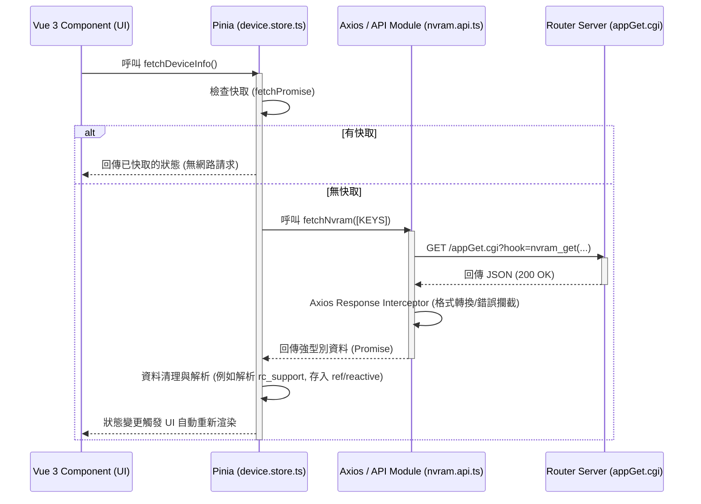
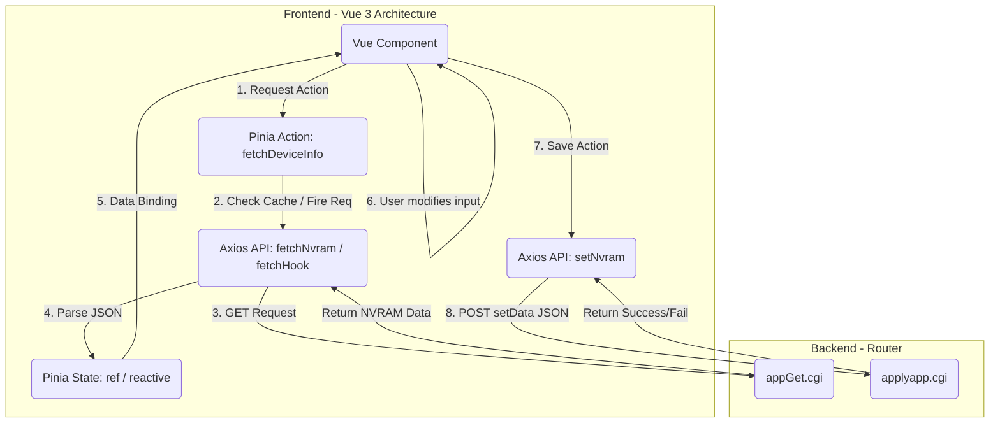

# API 與參數邏輯執行流程圖

本文檔使用 Mermaid.js 呈現 Legacy 舊版與 Modern 新版在 API 獲取、狀態管理及參數處理上的架構與資料流向差異。

## 1. 獲取資料流程對比 (Legacy vs Modern)

### 舊版 (Legacy - jQuery & 原生 JS)

### 新版 (Modern - Vue 3 + Pinia + Axios)

---

## 2. 參數設定與更新流程 (State & Params Flow)

本流程圖著重說明參數如何從後端取得，經過解析，最終在前端表單設定後寫回後端。

### 說明：
1. **舊版參數流向**: 資料讀取 -> `document.getElementById('input').value = data` -> 使用者修改 -> 觸發 `form.submit()`。
2. **新版參數流向**:
   - 資料統一由 Pinia 發送至 Axios (`fetchNvram`)。
   - 回傳後在 Store 內整理成 Reactive 狀態（如 `deviceSupport` 物件）。
   - Vue Component 透過響應式綁定 (`v-model`) 讀寫 Store。
   - 儲存時，呼叫 `setNvram` API，將整理好的 Payload 以 JSON 形式 POST 到 `applyapp.cgi`，不產生整頁刷新 (SPA 體驗)。