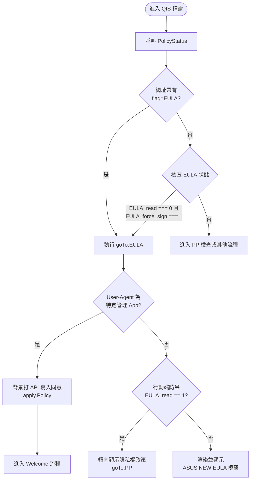

# ASUS NEW EULA 視窗顯示條件分析

根據對 Legacy 專案目錄 `C:\Users\Jieming\Documents\GitHub\www\sysdep\FUNCTION\QIS_V3\` 的原始碼分析，顯示「ASUS NEW EULA」視窗的觸發條件與內部路由邏輯主要實作於 `QIS_wizard.htm` (桌面版/主控端) 與 `mobile/js/handler.js` (行動版) 中。

## 1. 觸發顯示 EULA 視窗的條件

當進入 QIS 設定精靈（`QIS_wizard.htm` 載入時），系統會呼叫 `PolicyStatus()` 來取得目前的政策狀態。系統會根據以下三種方式決定是否要顯示 EULA 視窗（執行 `goTo.EULA()`）：

### A. 自動強制彈出 (主流程攔截)

必須**同時滿足**以下兩個條件，系統才會在進入 QIS 時第一優先強制跳轉至 EULA 視窗：

- `data.EULA_read === 0`：代表使用者在當前的韌體狀態下，尚未閱讀過 EULA。
- `data.EULA_force_sign === 1`：代表後端或系統變數強制要求使用者必須進行簽署或確認。

_註：EULA 的檢查優先權高於 PP（Privacy Policy）。程式碼邏輯會先檢查 EULA，若通過 (`EULA_read === 1`) 才會進一步檢查是否需要顯示 PP 視窗。_

### B. 透過網址參數手動觸發

如果網址 (URL) 包含 `flag=EULA` 參數，路由邏輯 (`switch (urlParameter.get("flag"))`) 會忽略一般流程，直接導向 `goTo.EULA()` 顯示 EULA 視窗。

### C. 行動端 (Mobile) 的防呆跳轉

在 `mobile/js/handler.js` 中，進入 `goTo.EULA()` 函數內部後，會再次檢查 `PolicyStatus()`。如果此時發現 `data.EULA_read == 1`（代表已經閱讀過），會直接跳轉去顯示隱私權政策 (`goTo.PP()`)，以避免重複顯示。若未閱讀，才會生成並渲染 `QisPolicyPageComponent` (設定為 `policy: "EULA"`)。

---

## 2. 特殊情境：APP 代理登入略過

在 `mobile/js/handler.js` 的 `goTo.EULA` 邏輯中，有一項針對「華碩特定管理 App」的例外略過機制：

```javascript
if (
  navigator.userAgent.match(/ASUSMultiSiteManager/) ||
  navigator.userAgent.match(/ASUSExpertSiteManager/)
) {
  apply.Policy();
  return;
}
```

**行為說明：**
如果系統偵測到使用者的 User-Agent 是從特定的商用/多站點管理 App（如 `ASUSMultiSiteManager` 或 `ASUSExpertSiteManager`）登入進來，系統將**不會顯示 EULA 視窗**，而是直接在背景呼叫 `apply.Policy()`，並強制寫入同意紀錄 (`httpApi.newEula.set("1")`) 然後繼續進入 Welcome 流程。

---

## 3. EULA 判斷與執行流程圖

以下為上述邏輯的 Mermaid 流程圖：


