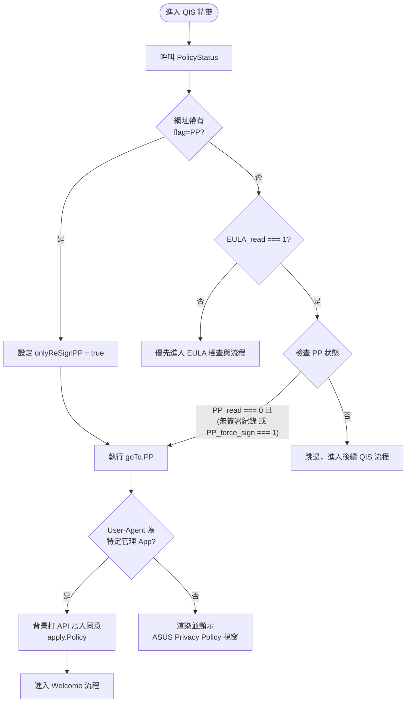

# ASUS Privacy Policy (PP) 視窗顯示條件分析

根據對 Legacy 專案目錄 `C:\Users\Jieming\Documents\GitHub\www\sysdep\FUNCTION\QIS_V3\` 的原始碼分析，顯示「ASUS Privacy Policy」視窗的觸發條件與內部路由邏輯主要實作於 `QIS_wizard.htm` (桌面版/主控端) 與 `mobile/js/handler.js` (行動版) 中。以下為核心歸納：

## 1. 觸發條件

- **自動彈出 (主流程攔截)：** 在進入 QIS 精靈時，系統會依序檢查政策狀態。當 `data.EULA_read === 1`（已閱讀過 EULA）且滿足以下條件時，會自動觸發跳轉至 Privacy Policy 視窗 (`goTo.PP()`)：
  - **條件一：** `data.PP_read === 0`（尚未閱讀過目前的隱私權政策）。
  - **條件二：** `data.PP === ""`（完全無簽署紀錄），**或者** `data.PP >= 0` 且 `data.PP_force_sign === 1`（曾簽署過但被後端強制要求重新簽署）。
  - *註：PP 的檢查順位排在 EULA 之後。必須先通過 EULA 的檢查，才會進入 PP 的判斷。*
- **網址參數：** 在網址帶上 `flag=PP` 會強制直接導向 Privacy Policy 視窗，同時會設定 `systemVariable.onlyReSignPP = true`。

---

## 2. 特殊 App 略過機制

- 在行動版邏輯 (`mobile/js/handler.js`) 中，當進入 `goTo.PP()` 函數時，有一個特殊的攔截機制：如果是從 `ASUSMultiSiteManager` 或 `ASUSExpertSiteManager` 這些管理 App 登入，系統會強制略過顯示 Privacy Policy，直接在背景打 API 寫入同意並進入流程。

```javascript
// 相關原始碼參考 (mobile/js/handler.js)
goTo.PP = function () {
    if (navigator.userAgent.match(/ASUSMultiSiteManager/) || navigator.userAgent.match(/ASUSExpertSiteManager/)) {
        apply.Policy();
        return;
    }
    // ... 後續的正常檢查與渲染邏輯
}
```

---

## 3. Privacy Policy 判斷與執行流程圖

以下為上述邏輯的 Mermaid 流程圖：

