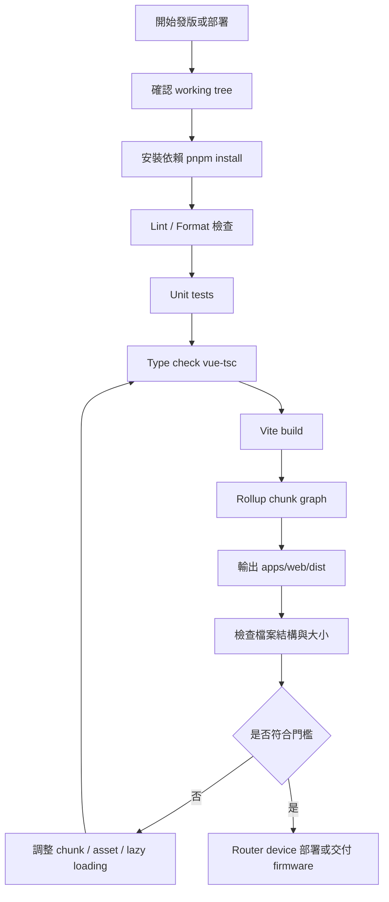
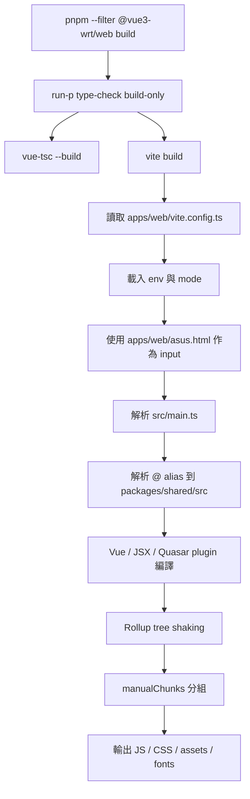
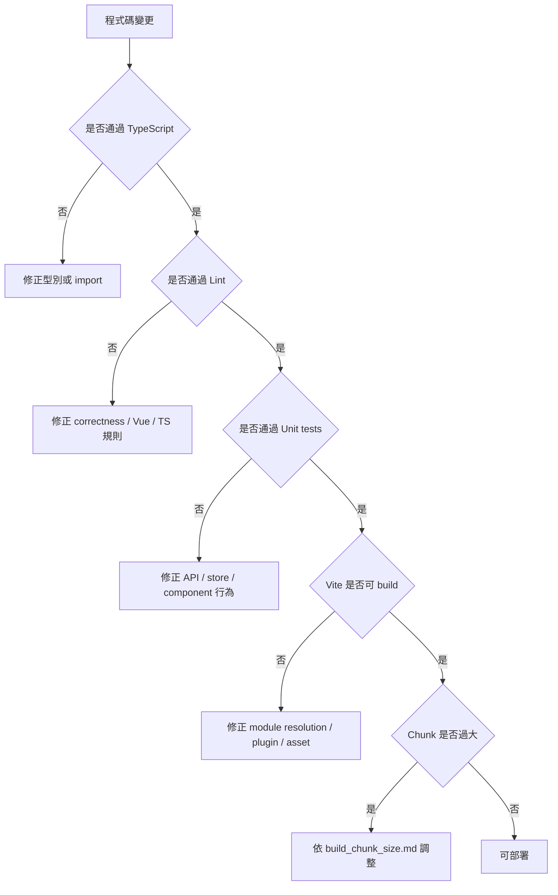
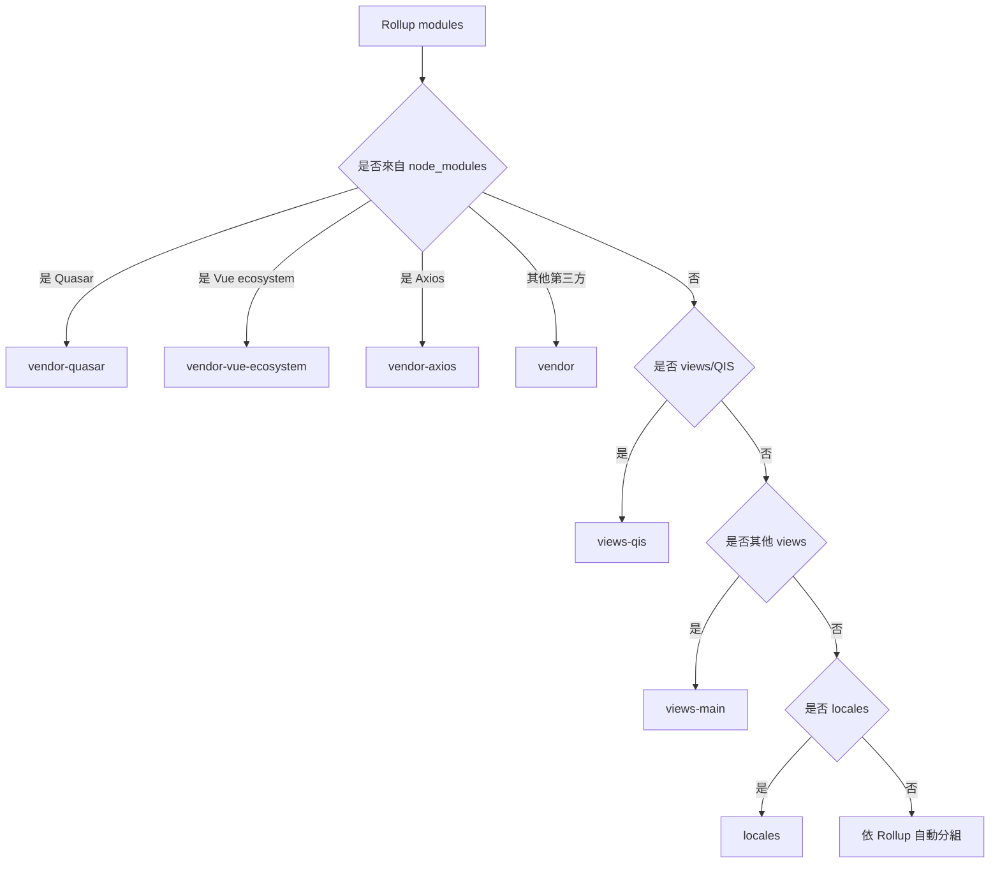
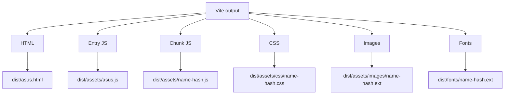
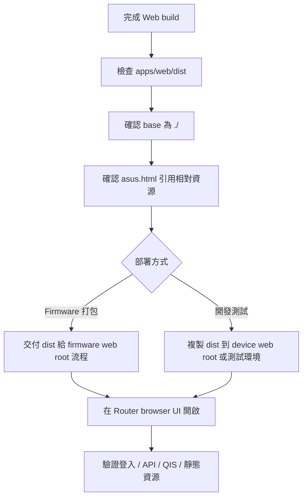
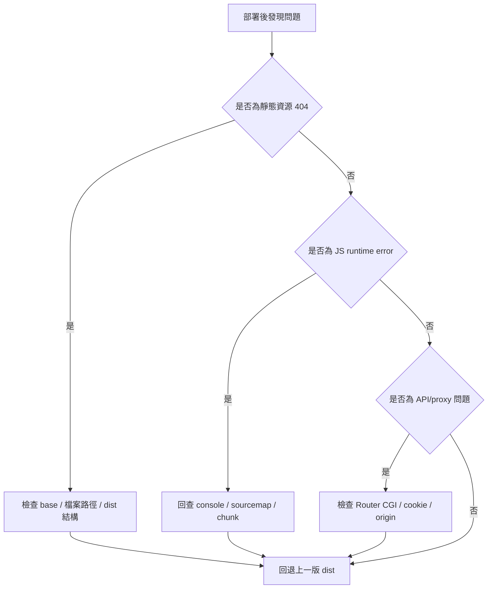

# Vite 打包運作流程圖

本文件描述本專案從程式檢查、Vite build、chunk/asset 產出，到部署 ASUS Router device 的主要流程與檢查點。

## 1. 整體打包流程

## 2. Web build 詳細流程

## 3. 檢查點流程

## 4. Chunk 與 Asset 產出流程

## 5. 輸出檔案流程

## 6. ASUS Router device 部署流程

## 7. 發版失敗回復流程

