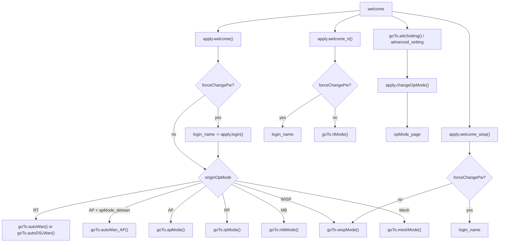
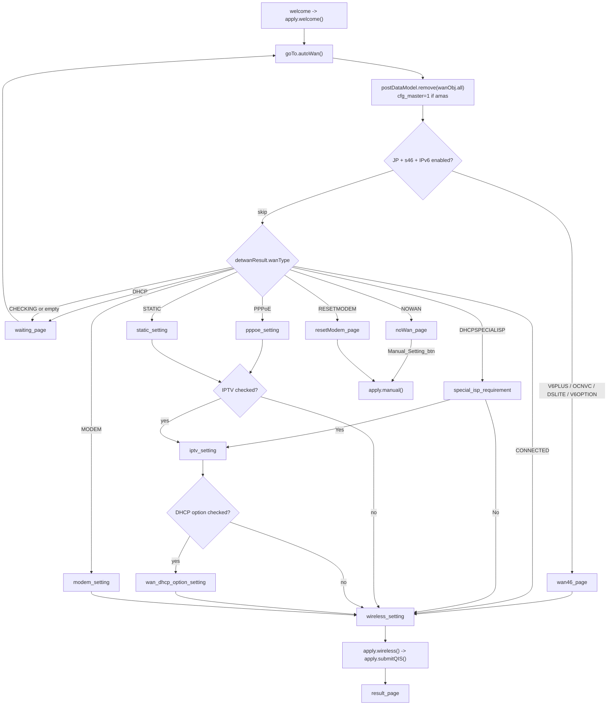
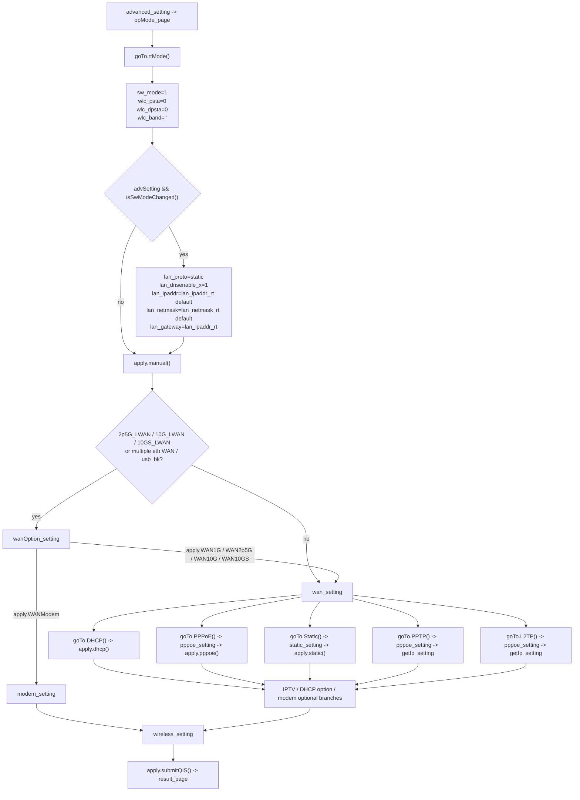
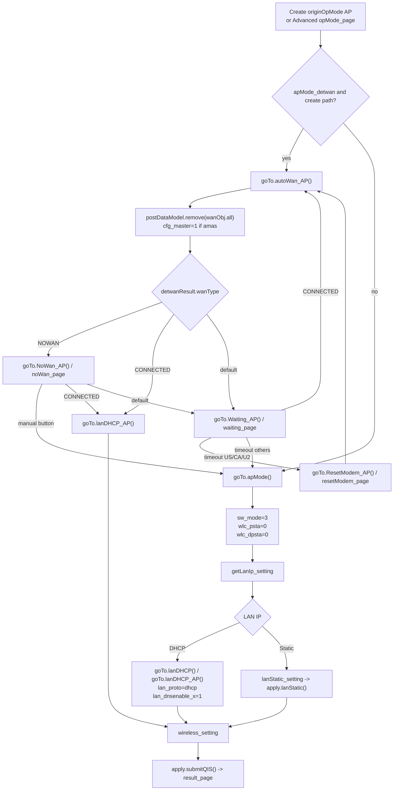
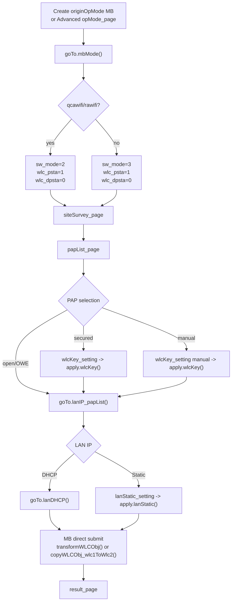
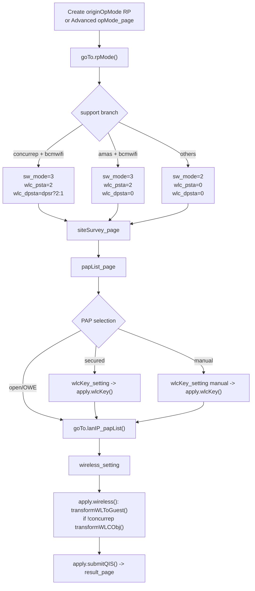
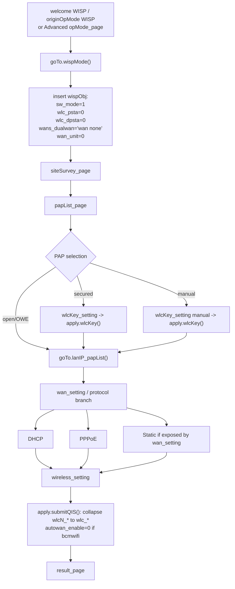
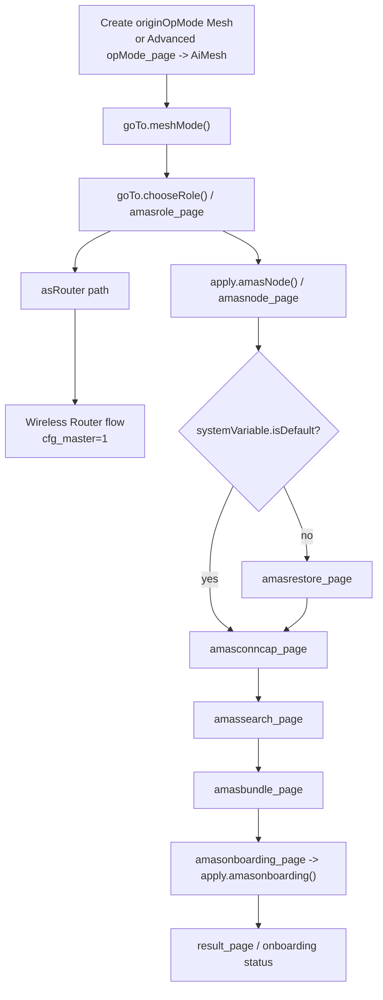
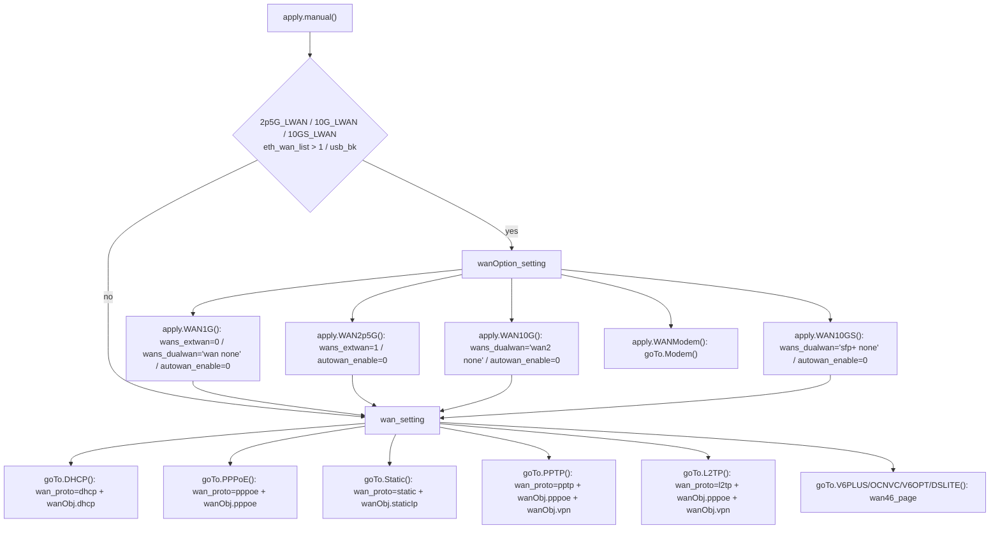
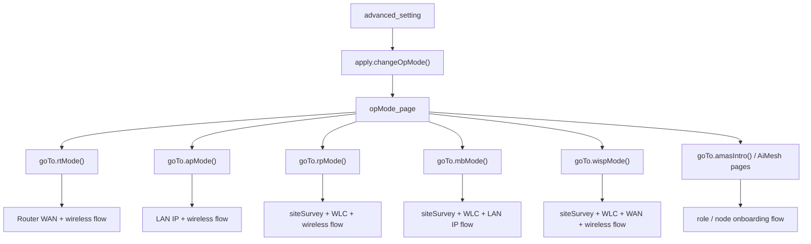

# Legacy QIS V3 流程解析

來源：

- `C:\Users\Jieming\Documents\GitHub\www\sysdep\FUNCTION\QIS_V3\QIS_wizard.htm`
- `C:\Users\Jieming\Documents\GitHub\www\sysdep\FUNCTION\QIS_V3\mobile\pages\*`
- `C:\Users\Jieming\Documents\GitHub\www\sysdep\FUNCTION\QIS_V3\mobile\js\qisData.js`
- `C:\Users\Jieming\Documents\GitHub\www\sysdep\FUNCTION\QIS_V3\mobile\js\handler.js`
- `C:\Users\Jieming\Documents\GitHub\www\sysdep\FUNCTION\QIS_V3\mobile\js\plugins.js`

原則：

- Stage/page/function 名稱只使用 Legacy 已存在的名稱。
- NVRAM 清單以 `qisData.js` 物件為主，並另列 `handler.js` / `plugins.js` 明確寫入的 legacy dynamic keys；不自行新增推測參數。
- CSS variable 依 `www\css\color-table.css`，QIS 共用樣式依 `QIS_V3\mobile\css\qis.css`。

## 1. QIS 初始化與主題

```mermaid
flowchart TD
  Load["QIS_wizard.htm"] --> Theme{"theme decision"}
  Theme -->|isSupport('rog')| ROG["data-asuswrt-theme=rog"]
  Theme -->|isSupport('tuf')| TUF["data-asuswrt-theme=tuf"]
  Theme -->|isSupport('BUSINESS')| Business["data-asuswrt-theme=business"]
  Theme -->|isSupport('proart')| ProArt["data-asuswrt-theme=proart"]
  Theme -->|default| ASUS["data-asuswrt-theme=asus"]
  ROG --> UI4{"isSupport('UI4')"}
  TUF --> UI4
  Business --> UI4
  ProArt --> UI4
  ASUS --> UI4
  UI4 -->|yes| Color{"productid GT-BE19000AI/GT-BE96_AI<br/>or business<br/>or odmpid startsWith ZenWiFi"}
  UI4 -->|no| Dark["data-asuswrt-color=dark"]
  Color -->|yes| Light["data-asuswrt-color=light"]
  Color -->|no| DarkUi4["data-asuswrt-color=dark"]
  Light --> Year{"isSupport('YEAR20')"}
  Dark --> Year
  DarkUi4 --> Year
  Year -->|yes| Style["data-asuswrt-style=20th"]
  Year -->|no| Init["initNvram + systemVariable"]
  Style --> Init
  Init --> Policy["PolicyStatus()"]
  Policy -->|EULA required| EULA["goTo.EULA() / policy_page"]
  Policy -->|PP required| PP["goTo.PP() / policy_page"]
  Policy -->|passed| Flag{"URL flag"}
  Flag -->|sitesurvey_rep| RpDirect["goTo.rpMode()"]
  Flag -->|lanip| ApDirect["goTo.apMode()"]
  Flag -->|sitesurvey_mb| MbDirect["goTo.mbMode()"]
  Flag -->|manual| OpMode["goTo.opMode() / opMode_page"]
  Flag -->|pppoe| Pppoe["goTo.PPPoE() / pppoe_setting"]
  Flag -->|wireless or mlo| Wireless["goTo.Wireless() / wireless_setting"]
  Flag -->|amasrole_page| Role["goTo.chooseRole() / amasrole_page"]
  Flag -->|amasnode_page| Node["goTo.asNode() / amasnode_page"]
  Flag -->|amas_addNode| Search["goTo.amassearch() / amassearch_page"]
  Flag -->|rtMode| RtFlag["advSetting=true -> goTo.rtMode()"]
  Flag -->|wispMode| WispFlag["advSetting=true -> goTo.wispMode()"]
  Flag -->|default| Welcome["goTo.Welcome() / welcome"]
```

## 2. Create a network 與 Advanced Settings 入口



## 3. Wireless Router mode

### 3.1 Create a network / auto detect



### 3.2 Advanced Settings / manual WAN



## 4. Access Point mode



## 5. Media Bridge mode



## 6. Repeater mode



## 7. WISP mode



## 8. AiMesh mode



## 9. WAN port / protocol



## 10. 模式切換



| To | 核心 legacy NVRAM |
| --- | --- |
| Wireless Router | `sw_mode=1`, `wlc_psta=0`, `wlc_dpsta=0`, `wlc_band=""`; AP/RP/MB/WISP 切回 RT 且 `advSetting && isSwModeChanged()` 時還原 RT 預設 LAN |
| Access Point | `sw_mode=3`, `wlc_psta=0`, `wlc_dpsta=0`; 接續 `getLanIp_setting` |
| Repeater | concurrep+bcmwifi: `sw_mode=3`, `wlc_psta=2`, `wlc_dpsta=dpsr?2:1`; amas+bcmwifi: `sw_mode=3`, `wlc_psta=2`, `wlc_dpsta=0`; others: `sw_mode=2`, `wlc_psta=0`, `wlc_dpsta=0` |
| Media Bridge | qcawifi/rawifi: `sw_mode=2`, `wlc_psta=1`, `wlc_dpsta=0`; others: `sw_mode=3`, `wlc_psta=1`, `wlc_dpsta=0` |
| WISP | `sw_mode=1`, `wlc_psta=0`, `wlc_dpsta=0`, `wans_dualwan="wan none"`, `wan_unit=0` |
| AiMesh | Router role follows RT with `cfg_master=1`; node role uses onboarding command data |

## 11. CSS 輸出

- 共用 QIS CSS 寫入 `packages\shared\src\assets\qis.css`。
- 主題變數寫入 `packages\shared\src\assets\color-table.css`。
- `packages\shared\src\assets\main.css` 先匯入 `color-table.css`，再匯入 `qis.css`，符合 Legacy `color-table.css -> qis.css` 的載入順序。

