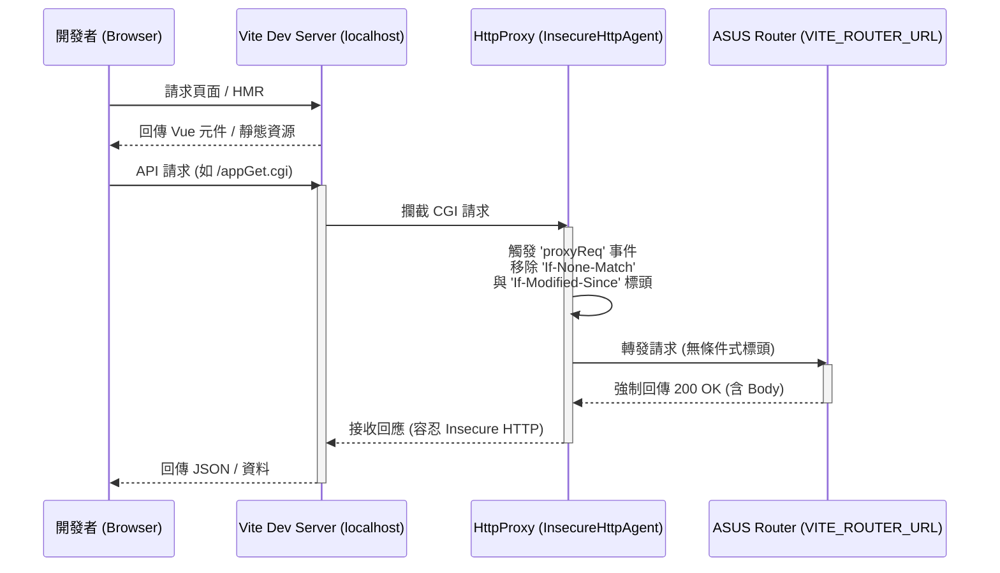
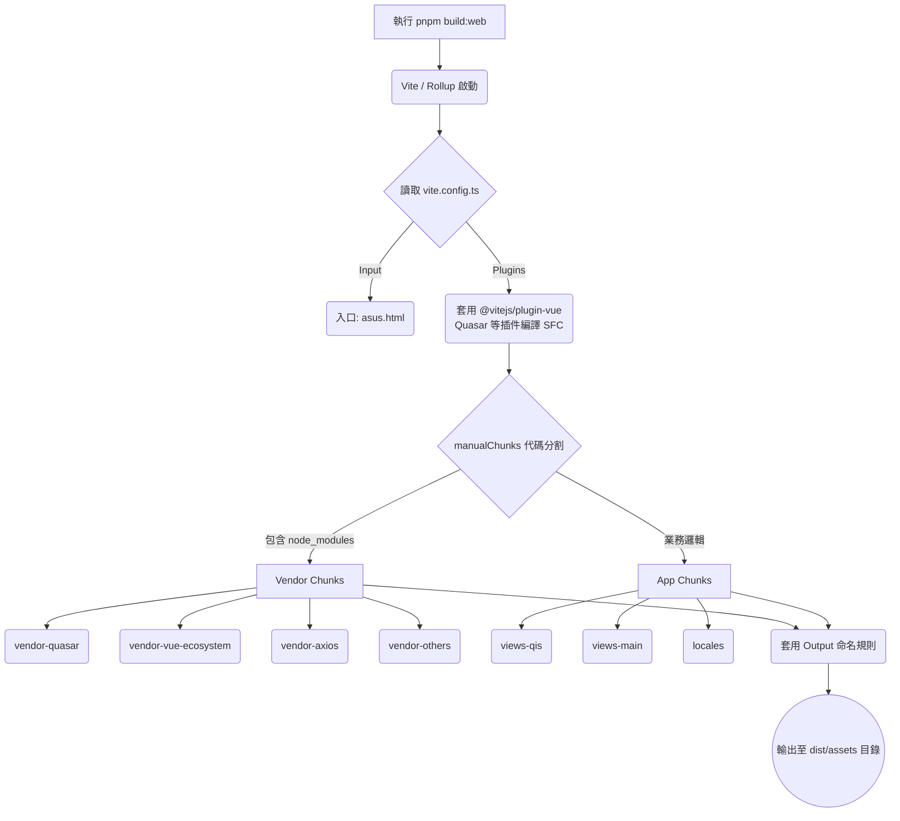

# Vite 打包與代碼檢查流程圖

本文檔使用 Mermaid.js 呈現 `vue3-wrt-project` 中 Vite 的打包流程 (開發與生產環境) 以及 JavaScript 代碼的合法性檢查流程。

## 1. Vite 打包與運行流程

### 1.1 開發環境 (Dev Server + Proxy)

這張圖展示了 Vite 開發伺服器如何啟動，以及它如何處理並代理對 ASUS 路由器後端的 CGI 請求，解決 304 狀態碼造成的 Node 解析錯誤。



### 1.2 生產環境打包流程 (Rollup Build)

這張圖說明了執行 `build:web` 時，Vite 底層的 Rollup 如何依據配置進行代碼分割 (Code Splitting)。



---

## 2. JavaScript 代碼合法性檢查流程

這張圖說明了在專案中，代碼如何經過雙引擎 Linter (Oxlint + ESLint) 以及 TypeScript (tsc) 的層層把關。

```mermaid
flowchart LR
    A([開發者撰寫/修改代碼]) --> B{提交前或執行 pnpm lint}
    
    subgraph 第一道防線：極速語法掃描
        B --> C[Oxlint]
        C -->|發現語法錯誤/無效變數| D((阻擋並提示修正))
    end
    
    subgraph 第二道防線：深度邏輯與規範檢查
        C -->|Oxlint 通過| E[ESLint Flat Config]
        E --> F1(@vue/eslint-config-typescript)
        E --> F2(eslint-plugin-vue)
        E --> F3(eslint-plugin-playwright)
        
        F1 --> G{是否符合規範?}
        F2 --> G
        F3 --> G
        G -->|否| D
    end
    
    subgraph 第三道防線：型別與風格
        G -->|是| H[TypeScript tsc 類型檢查]
        H -->|發現型別不符| D
        H -->|通過| I[Prettier 自動格式化]
    end
    
    I --> J([代碼合法，允許合併/打包])
```