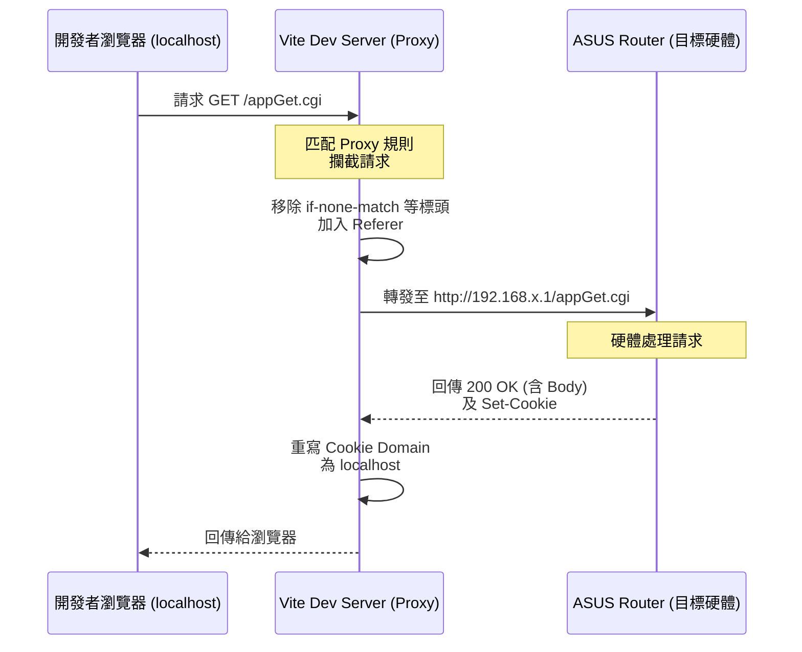

# Vite Dev Proxy Server 運作分析報告

在 `vue3-wrt-project` 中，為了讓現代化的 Vue 3 開發環境能順利與 ASUS 硬體路由器（Legacy Web UI 與內嵌的 `httpd`）進行 API 串接，專案利用 Vite 的 Dev Proxy 伺服器建構了一套極具容錯性的轉發機制。

## 1. 開發代理伺服器的核心配置

代理伺服器的主要職責是攔截本地端 (`http://localhost:5173`) 特定的請求，並將它們原封不動地轉發到硬體路由器（例如 `http://www.asusrouter.com` 或 `.env` 中指定的 IP），以解決前後端分離開發時最惱人的**跨域 (CORS)** 阻擋問題。

### 1.1 請求轉發範圍與機制
在 `apps/web/vite.config.ts` 的設定中，開發模式下攔截了以下幾種關鍵路徑：
- **CGI API (`*.cgi`)**: 如 `/appGet.cgi`、`/apply.cgi`，這些是用來獲取狀態與設定路由器的關鍵接口。
- **遺留資源 (`*.asp`, `*.json`)**: 針對舊有的 ASP 頁面或 JSON 數據檔，將其直接轉發以獲得真實狀態。
- **Captcha 與其他資源 (`*.cfg`, `*.log`, `*.ico`, `captcha.gif`)**: 驗證碼等資源因為必須綁定 Session，所以不能由 Vite 本地靜態伺服器處理，需要轉發到設備。

### 1.2 跨域、Cookie 與認證支援
透過以下 Proxy 參數，保證了與硬體串接時認證狀態不遺失：
- `changeOrigin: true`: 將請求的源頭 (Origin) 變更為目標路由器，避免硬體的防護機制阻擋跨域請求。
- `cookieDomainRewrite: 'localhost'`: 將硬體回傳的 Cookie (`Set-Cookie`) 網域重寫為本地 `localhost`。確保登入成功的 Session 可以存回開發者的瀏覽器。
- `headers: { Referer: routerUrl }`: 模擬真實路由器的 Referer 標頭，繞過傳統設備內建的簡易 CSRF 檢查。

## 2. 針對 ASUS 設備硬體的客製化容錯處理

本專案中最核心且困難的挑戰在於：**ASUS 路由器內建的 `httpd` 在處理 HTTP 的條件式請求時，回傳的 304 狀態碼違背了 HTTP 規範（附帶了 Body）。**
此舉會導致 Node.js 的原生解析器崩潰，拋出 `Parse Error: Expected HTTP/`。

為此，Vite Proxy 配置了雙重防禦機制：

### 2.1 放寬 Node.js 的 HTTP 嚴謹度 (`InsecureHttpAgent`)
```typescript
class InsecureHttpAgent extends http.Agent {
    addRequest(req: http.ClientRequest, options: http.ClientRequestArgs) {
        // 強制開啟 Node.js 的 HTTP 容錯模式
        (req as any).insecureHTTPParser = true;
        return super.addRequest(req, options);
    }
}
// 在 proxy 設定中掛載 agent: insecureAgent
```

### 2.2 主動移除條件式緩存標頭 (`stripConditionalHeaders`)
攔截所有透過 Proxy 發出去的請求，主動把 `if-none-match` 與 `if-modified-since` 標頭砍掉。
這樣一來，硬體設備就會以為是全新的請求，每次都乖乖地回傳 `200 OK`（含 Body），而不再觸發帶有 Body 的 304 錯誤，徹底解決了開發時動不動就斷線的痛點。

---

## 3. 交互流程圖

