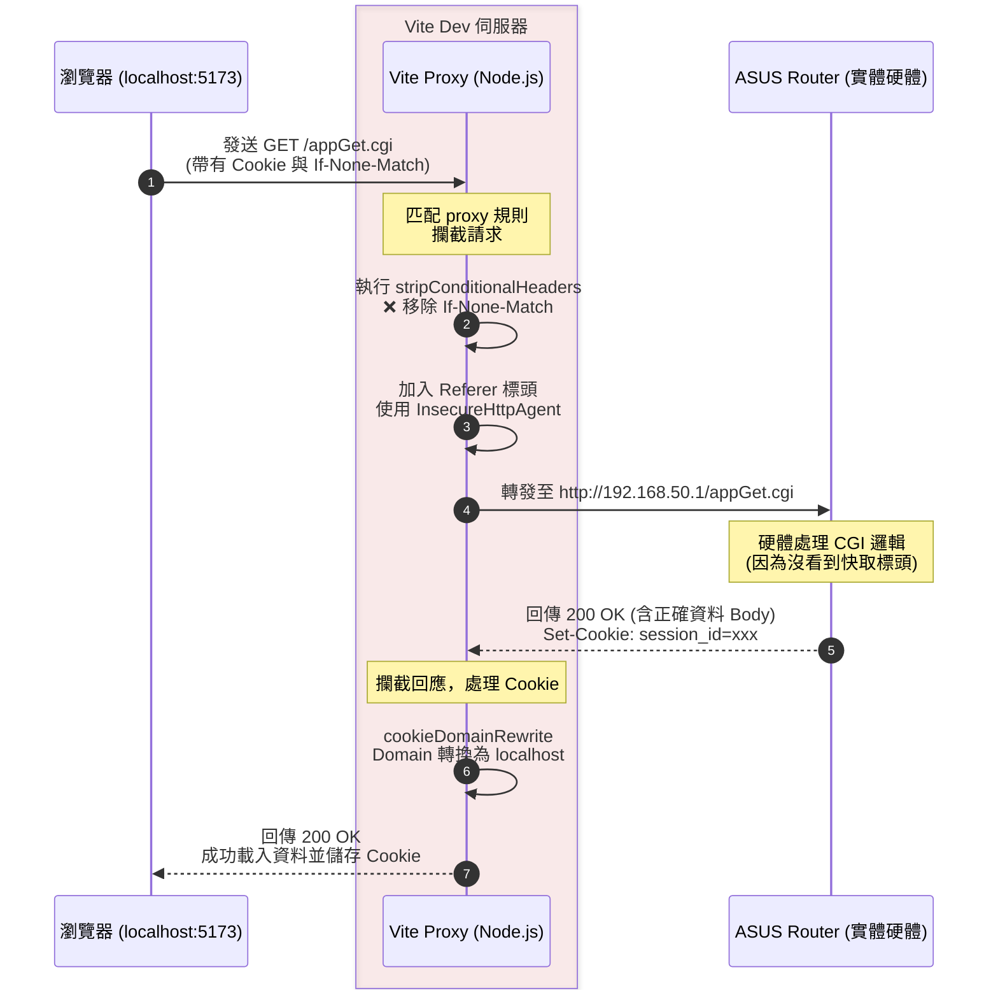

# Vite Dev Proxy 運作解析 🌐

本地開發如何無縫串接實體 ASUS Router 的 CGI

---

# 1. 為什麼我們需要 Proxy？ 🤔

**問題情境：前後端分離的痛點**

- **前端 (Vue 3)** 運行於：`http://localhost:5173`
- **後端 (ASUS Router)** 運行於：`http://192.168.50.1` (或 `.com`)

當前端用 Axios 打 API 給硬體時，瀏覽器會因為網域不同而祭出 **CORS (跨來源資源共用) 封殺**。
即使成功發送，硬體回傳的 Session Cookie 也會因為跨域而無法寫入瀏覽器，導致「永遠登入失敗」。

👉 **解決方案：** 利用 Vite 內建的 Node.js 伺服器建立 **Proxy (代理)**，讓前端以為自己在呼叫自己。

---

# 2. Vite Proxy 的基本運作設定 🛠️

在 `vite.config.ts` 中，我們針對 `*.cgi`、`*.asp` 與硬體資源設定了代理規則：

```typescript
const proxyConfig = {
    '/appGet.cgi': {
        target: 'http://192.168.50.1/',  // 將請求轉發至實際硬體
        changeOrigin: true,              // 隱藏 localhost，偽裝為硬體網域
        cookieDomainRewrite: 'localhost',// 讓硬體發出的 Cookie 成功綁定回 localhost
        headers: {
            Referer: routerUrl,          // 欺騙 Router 的簡易 CSRF 檢查
        },
    }
}
```
**效益**：前端代碼只要寫 `axios.get('/appGet.cgi')`，Proxy 就會在背景默默轉發至硬體並將結果傳回。

---

# 3. 💣 挑戰：ASUS httpd 的致命 Bug

當我們滿心歡喜地啟動 Proxy，卻發現 Node.js 瘋狂報錯崩潰：
`Parse Error: Expected HTTP/, RTSP/ or ICE/`

**兇手是誰？**
ASUS 路由器內的舊式 `httpd` 伺服器存在一個不符合標準的行為：
當瀏覽器發出帶有快取檢查的「條件式請求」(`If-None-Match`) 時，硬體會回傳 `304 Not Modified`，**卻違規地附帶了完整的 HTML/JSON Body！**

標準 HTTP 協定中，304 是絕對不能有 Body 的。Node.js 的原生解析器極度嚴格，看到 304 後面跟著 Body，就會當作「下一個封包的起頭」，然後直接崩潰報錯。

---

# 4. 🛡️ 雙重容錯防禦機制

為了解決這個硬體遺留問題，我們在 Proxy 內掛載了兩道防線：

### 防線 1：強制降低 Node.js 嚴謹度
```typescript
class InsecureHttpAgent extends http.Agent {
    addRequest(req, options) {
        req.insecureHTTPParser = true; // 開啟寬容解析模式
        return super.addRequest(req, options);
    }
}
```

### 防線 2：剝奪快取標頭 (釜底抽薪)
```typescript
const stripConditionalHeaders = (proxy) => {
    proxy.on('proxyReq', (proxyReq) => {
        // 發給硬體前，拔掉快取標頭，強迫硬體永遠乖乖回傳 200 OK
        proxyReq.removeHeader('if-none-match');
        proxyReq.removeHeader('if-modified-since');
    });
};
```

---

# 5. 流程圖：Vite Proxy 完整交火過程 🔄



---

# 6. 總結 💡

透過 Vite Proxy 的設定，我們達成了：
1. **無痛跨域**：前端代碼完全無需修改，順利呼叫硬體 CGI。
2. **會話維持**：成功保留 Session Cookie 讓登入不失效。
3. **極致容錯**：以客製化的 `Agent` 與標頭攔截，完美化解 ASUS 舊有 `httpd` 的非標準 304 崩潰危機。

👉 **注意事項：此機制僅存活於開發階段 (`pnpm dev`)，上機打包後 (`pnpm build`) 則仰賴同源政策運作。**

---

# Q & A
感謝聆聽！