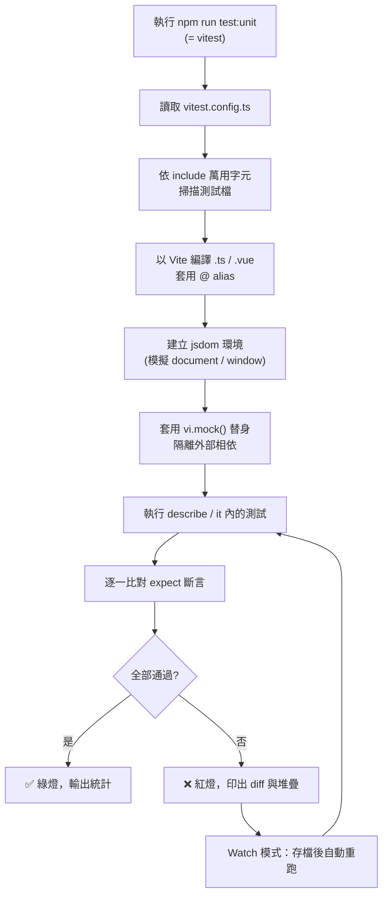
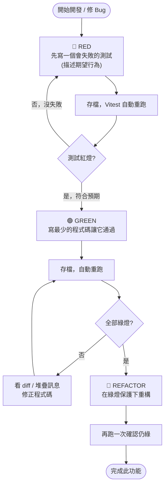
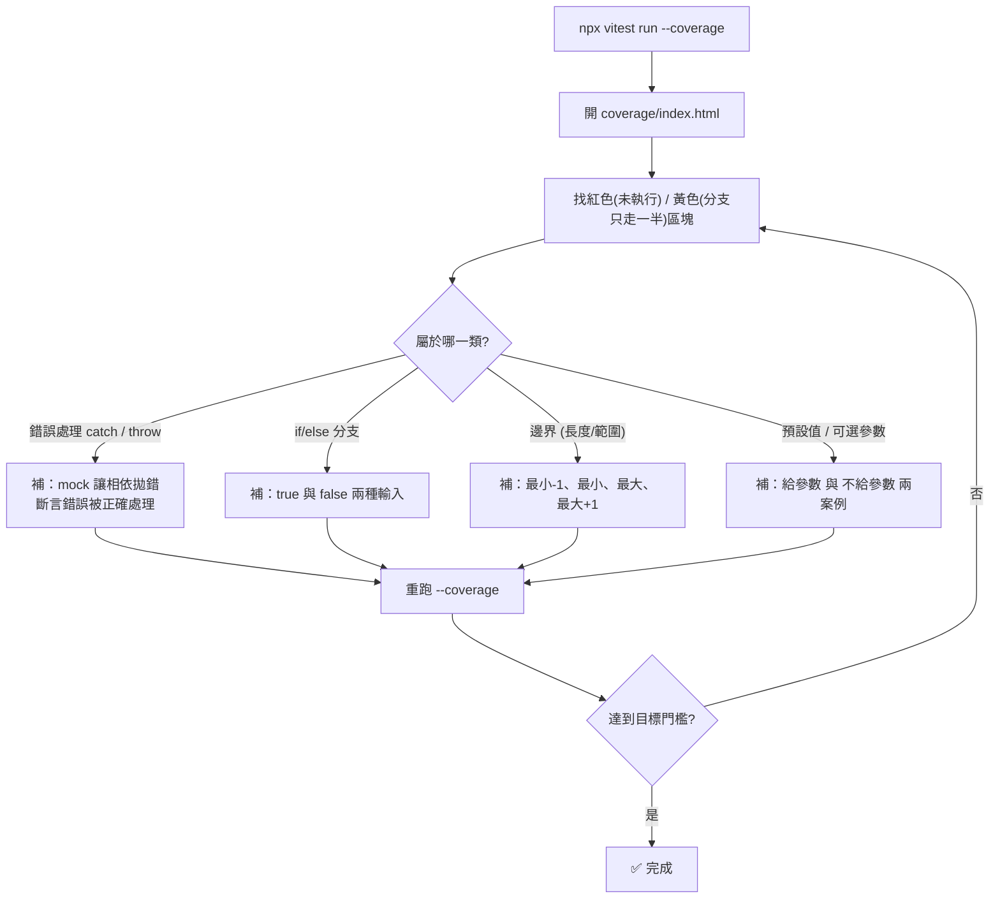
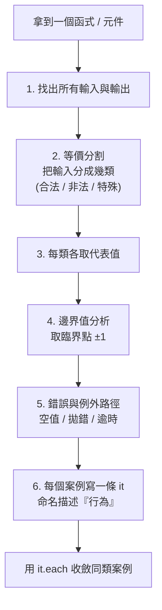
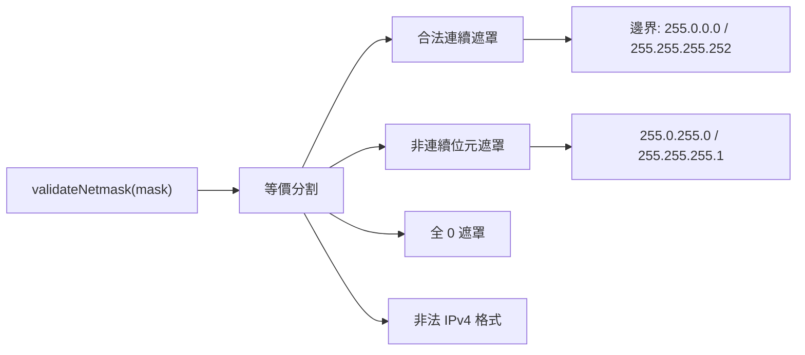
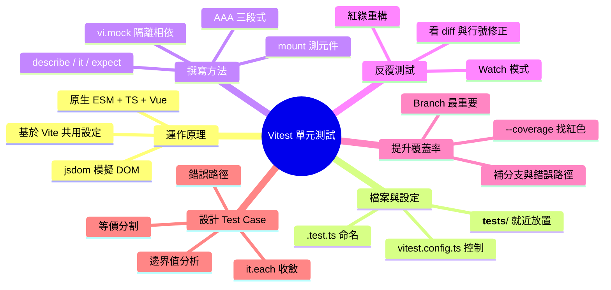

# Vue 3 專案 Vitest 單元測試完整指南（簡報版）

> 以 `vue3-wrt-project`（ASUS 路由器 Web UI）實際程式碼為範例，說明 Vitest 單元測試如何運作、測試檔怎麼寫、如何反覆測試、如何提升覆蓋率，以及如何設計 test case。

---

## 0. 簡報大綱（給講者）

| # | 主題 | 一句話重點 |
|---|------|-----------|
| 1 | Vitest 是什麼、如何運作 | 與 Vite 共用設定的超快測試框架，原生支援 ESM / TS / Vue |
| 2 | 測試檔放哪、如何設定 | 與原始碼同層的 `__tests__/` 目錄，由 `vitest.config.ts` 控制 |
| 3 | 怎麼寫測試 | `describe / it / expect` + AAA 三段式 |
| 4 | 如何反覆測試 | Watch 模式 + 紅綠重構（Red-Green-Refactor） |
| 5 | 如何提升覆蓋率 | `--coverage` 找出未測分支，補邊界與錯誤路徑 |
| 6 | 如何設計 test case | 等價分割 + 邊界值 + 錯誤路徑 + `it.each` |

::: tip 本專案測試現況
目前 `src/` 下共有 **65** 個單元測試檔，涵蓋 `utils`、`composables`、`stores`、`components`、`api`、`router`、`services`、`layouts`、`views`。E2E 測試（Playwright）另放在 `e2e/`，不在本文討論範圍。
:::

---

## 1. Vitest 是什麼、如何運作？

### 1.1 核心概念

**Vitest** 是一個基於 **Vite** 的單元測試框架，語法與 Jest 高度相容（`describe / it / expect`），但有幾個關鍵優勢：

- **共用 Vite 設定**：`resolve.alias`、TypeScript、Vue SFC 編譯都直接沿用，不必為測試另外配一套 Babel/webpack。
- **原生 ESM + TypeScript**：`.ts`、`.vue` 直接吃，免轉譯設定。
- **極快**：基於 Vite 的 transform pipeline 與智慧快取，只重跑受影響的檔案。
- **內建能力**：mock、fake timers、snapshot、coverage 全部內建。

### 1.2 本專案的技術組合

| 工具 | 版本 | 角色 |
|------|------|------|
| `vitest` | ^4.1.3 | 測試執行器 + 斷言 + mock |
| `jsdom` | ^29 | 在 Node 模擬瀏覽器 DOM（`document`、`window`） |
| `@vue/test-utils` | ^2.4.6 | 掛載 Vue 元件、操作與斷言 |
| `pinia` | ^3 | 狀態管理（store 測試需建立 Pinia 實例） |
| `@vitejs/plugin-vue` | ^6 | 讓測試能編譯 `.vue` 單檔元件 |

### 1.3 一次測試執行的生命週期



::: info 為什麼單元測試要 jsdom？
單元測試跑在 Node（沒有瀏覽器），但 Vue 元件需要 `document` 才能掛載。`environment: 'jsdom'` 會在記憶體裡模擬一份 DOM，讓元件可以被 mount、查詢、觸發事件，速度遠快於開真實瀏覽器。
:::

---

## 2. 測試檔放哪？如何設定？

### 2.1 檔案放置慣例：與原始碼「就近放置」

本專案採用 **co-location（就近放置）**：測試檔放在被測檔案旁邊的 `__tests__/`（或少數 `__test__/`）目錄，副檔名為 `.test.ts`。

```text
src/
├── utils/
│   ├── validators.ts                ← 被測檔
│   └── __tests__/
│       └── validators.test.ts       ← 測試檔
├── composables/
│   ├── useLoading.ts
│   └── __tests__/
│       └── useLoading.test.ts
├── stores/
│   ├── auth.store.ts
│   └── __tests__/
│       └── auth.store.test.ts
└── components/
    ├── Dialog.vue
    └── __tests__/
        └── Dialog.test.ts
```

**就近放置的好處**：

- 一眼看出哪些檔案有測試、哪些沒有。
- 改 A 檔時，旁邊的 `A.test.ts` 立刻提醒你要同步更新測試。
- 刪除功能時，測試也一起刪，不會留下孤兒測試。

### 2.2 設定檔：`vitest.config.ts`

本專案刻意把測試設定**獨立**成 `vitest.config.ts`（而非塞進 `vite.config.ts`），這樣測試時不會載入 dev proxy、Quasar plugin 等只在開發/打包需要的笨重設定：

```ts
// vitest.config.ts
import { fileURLToPath } from 'node:url';
import { defineConfig } from 'vitest/config';
import vue from '@vitejs/plugin-vue';
import vueJsx from '@vitejs/plugin-vue-jsx';

export default defineConfig({
    plugins: [vue(), vueJsx()],          // ① 能編譯 .vue / JSX
    resolve: {
        alias: {
            '@': fileURLToPath(new URL('./src', import.meta.url)), // ② @ → src
        },
    },
    test: {
        environment: 'jsdom',            // ③ 模擬瀏覽器 DOM
        root: fileURLToPath(new URL('./', import.meta.url)),
        include: [                       // ④ 哪些檔案算測試
            'src/**/__tests__/**/*.test.ts',
            'src/**/__test__/**/*.test.ts',
        ],
    },
});
```

| 設定 | 作用 | 對撰寫測試的影響 |
|------|------|-----------------|
| `plugins: [vue(), vueJsx()]` | 編譯 SFC / JSX | 測試裡才能 `import Dialog from '@/components/Dialog.vue'` |
| `resolve.alias['@']` | 路徑別名 | 測試用 `@/utils/...` 而非一堆 `../../` |
| `environment: 'jsdom'` | DOM 環境 | 元件可被 `mount()`、可存取 `window` |
| `include` | 測試檔比對規則 | **檔名必須符合此 glob，否則不會被執行** |

::: warning 新建測試檔的鐵則
檔案必須放在 `__tests__/`（或 `__test__/`）內，且以 **`.test.ts`** 結尾，才會被 `include` 撈到。放錯位置或命名（例如 `Foo.spec.ts` 放在 `src/` 根層）會被靜默忽略，跑出來「0 個測試」卻不報錯。
:::

### 2.3 執行指令

```bash
# package.json scripts
npm run test:unit      # 等同 vitest，互動式終端預設進入 Watch 模式
```

| 指令 | 用途 |
|------|------|
| `npm run test:unit` | 互動式 Watch 模式（開發時用） |
| `npx vitest run` | 跑一次就結束（CI / commit 前用） |
| `npx vitest run src/utils` | 只跑某資料夾 |
| `npx vitest validators` | 只跑檔名含 `validators` 的測試 |
| `npx vitest --ui` | 開網頁 UI 看結果與覆蓋率 |
| `npx vitest run --coverage` | 跑一次並產生覆蓋率報告 |

---

## 3. 如何撰寫測試？三段式 AAA 結構

所有測試都遵循 **AAA** 模式，配合 `describe`（分組）、`it`（單一案例）、`expect`（斷言）：


```ts
import { describe, it, expect } from 'vitest';

describe('被測單元的名稱', () => {        // 分組
    it('在某情境下應產生某結果', () => {  // 單一案例（描述「行為」而非「實作」）
        const input = '...';            // Arrange 準備
        const result = doSomething(input); // Act 執行
        expect(result).toBe('expected');  // Assert 斷言
    });
});
```

下面用專案中四種典型情境的真實程式碼來示範。

### 3.1 案例 A：純函式（最簡單）— `validators.ts`

純函式沒有副作用，輸入決定輸出，是最好寫的測試。重點在於**列舉各種輸入**：

```ts
// src/utils/__tests__/validators.test.ts
import { describe, it, expect } from 'vitest';
import { validateKRSkuPwd, validateIpv4 } from '@/utils/validators';

describe('validateKRSkuPwd', () => {
    it('長度不足 10 字元應回傳錯誤訊息', () => {
        expect(validateKRSkuPwd('Ab1!xxxx')).toBe('密碼長度至少需 10 個字元');
    });

    it('合法密碼應回傳 null', () => {
        expect(validateKRSkuPwd('Abcdef12!@')).toBeNull();
    });
});

// 用 it.each 對「一組輸入」套同一條斷言，避免複製貼上
describe('validateIpv4', () => {
    it.each(['192.168.1.1', '0.0.0.0', '255.255.255.255', '8.8.8.8'])(
        '%s 應為合法 IPv4',
        (ip) => {
            expect(validateIpv4(ip)).toBe(true);
        },
    );

    it.each(['', '1.2.3', '1.2.3.4.5', '256.0.0.1', '1.2.3.a'])(
        '格式錯誤（%s）應為不合法',
        (ip) => {
            expect(validateIpv4(ip)).toBe(false);
        },
    );
});
```

::: tip `it.each` 是覆蓋率神器
一條 `it.each([...])` 就能把「合法清單」「非法清單」「邊界值」全部跑過，程式碼少、覆蓋面廣。本專案 `validators.test.ts` 大量使用它測 SSID 長度邊界（1 / 32 / 33 字元）與 IPv4 各種畸形格式。
:::

### 3.2 案例 B：Composable（含 mock 與假計時器）— `useLoading.ts`

`useLoading` 依賴 Quasar 的 `$q.loading` 並使用 `setInterval` 倒數。測試時要**把外部相依換成替身**，並用**假計時器**控制時間：

```ts
// src/composables/__tests__/useLoading.test.ts
import { describe, it, expect, vi, beforeEach, afterEach } from 'vitest';
import useLoading from '@/composables/useLoading';

const mockShow = vi.fn();
const mockHide = vi.fn();

// ① 把 quasar 整包換成替身，攔截 loading.show / hide
vi.mock('quasar', () => ({
    useQuasar: () => ({ loading: { show: mockShow, hide: mockHide } }),
    QSpinnerTail: 'QSpinnerTail',
    QSpinnerClock: 'QSpinnerClock',
    // ...其餘 spinner 常數
}));

describe('useLoading', () => {
    beforeEach(() => {
        vi.clearAllMocks();   // ② 每個測試前清空呼叫紀錄
        vi.useFakeTimers();   // ③ 接管 setInterval / setTimeout
    });
    afterEach(() => {
        vi.useRealTimers();   // ④ 還原真實計時器，避免污染其他測試
    });

    it('倒數計時應每秒更新百分比', () => {
        const { showLoading } = useLoading();
        showLoading({ waitSeconds: 4 });

        expect(mockShow).toHaveBeenCalledTimes(1);        // 初始 0%
        vi.advanceTimersByTime(1000);                     // 手動快轉 1 秒
        expect(mockShow.mock.calls[1][0].message).toContain('(25%)');
        vi.advanceTimersByTime(1000);                     // 再快轉 1 秒
        expect(mockShow.mock.calls[2][0].message).toContain('(50%)');
    });
});
```

**這裡示範了三個關鍵技巧**：

1. **`vi.mock('quasar', ...)`**：隔離外部 UI 框架，測試只關心「有沒有用正確參數呼叫 loading」。
2. **`vi.useFakeTimers()` + `vi.advanceTimersByTime()`**：測「倒數計時」這種時間相關邏輯，不必真的等 4 秒。
3. **`beforeEach / afterEach`**：每個測試前後重置狀態，確保測試之間**互相獨立**。

### 3.3 案例 C：Pinia Store（含非同步與錯誤路徑）— `auth.store.ts`

Store 測試要先 `setActivePinia(createPinia())` 建立乾淨的 store 實例，並把 API 模組 mock 掉：

```ts
// src/stores/__tests__/auth.store.test.ts
import { describe, it, expect, vi, beforeEach } from 'vitest';
import { setActivePinia, createPinia } from 'pinia';
import { useAuthStore } from '@/stores/auth.store';

vi.mock('@/api/hook.api', () => ({ fetchHook: vi.fn() }));
import { fetchHook } from '@/api/hook.api';
const mockFetchHook = fetchHook as unknown as ReturnType<typeof vi.fn>;

describe('auth.store', () => {
    beforeEach(() => {
        setActivePinia(createPinia()); // 每個測試一個全新的 Pinia
        vi.clearAllMocks();
    });

    it('fetchHook 回傳有效物件時應認證成功', async () => {
        mockFetchHook.mockResolvedValue({ get_ui_support: {} }); // 安排成功回應
        const store = useAuthStore();
        await store.checkAuth();                                  // 注意 await
        expect(store.isAuthenticated).toBe(true);
    });

    it('fetchHook 拋錯時應認證失敗但 authReady 為 true', async () => {
        mockFetchHook.mockRejectedValue(new Error('Network Error')); // 安排失敗
        const store = useAuthStore();
        await store.checkAuth();
        expect(store.isAuthenticated).toBe(false);
        expect(store.authReady).toBe(true);   // 確認錯誤被妥善處理
    });
});
```

::: warning 非同步測試一定要 `await`
測 `async` action 時，`it` 的 callback 要寫成 `async`，並 `await` 被測動作。忘記 `await` 會在 Promise 還沒 resolve 時就跑斷言，造成假性通過或時序錯亂。
:::

### 3.4 案例 D：Vue 元件（掛載 + slot + props）— `Dialog.vue`

元件測試用 `@vue/test-utils` 的 `mount()`，並把 Quasar 子元件 **stub（替換成簡單 div）**，讓 slot 內容直接渲染好斷言：

```ts
// src/components/__tests__/Dialog.test.ts
import { describe, it, expect } from 'vitest';
import { mount } from '@vue/test-utils';
import { defineComponent, h } from 'vue';
import Dialog from '@/components/Dialog.vue';

// 把 q-dialog 換成只在 modelValue=true 時渲染 slot 的簡單元件
const stubs = {
    'q-dialog': defineComponent({
        props: ['modelValue'],
        setup(props, { slots }) {
            return () => (props.modelValue ? h('div', slots.default?.()) : null);
        },
    }),
    // q-card / q-card-section / q-btn ... 同理 stub
};

function mountDialog(props = {}, slots = {}) {
    return mount(Dialog, { props: { showDialog: true, ...props }, slots, global: { stubs } });
}

describe('Dialog.vue', () => {
    it('showDialog 為 true 時應渲染預設內容', () => {
        const wrapper = mountDialog();
        expect(wrapper.html()).toContain('MODEL NAME');
    });

    it('應渲染自訂 title slot', () => {
        const wrapper = mountDialog({}, { title: 'Custom Title' });
        expect(wrapper.html()).toContain('Custom Title');
        expect(wrapper.html()).not.toContain('MODEL NAME'); // 確認被覆蓋
    });

    it('showDialog 為 false 時不應顯示內容', () => {
        const wrapper = mountDialog({ showDialog: false });
        expect(wrapper.html()).not.toContain('MODEL NAME');
    });
});
```

**元件測試常用 API**：`wrapper.html()`（看渲染結果）、`wrapper.props()`（看屬性）、`wrapper.find('.selector')`、`await wrapper.find('button').trigger('click')`（觸發事件後要 `await` 等 DOM 更新）。

---

## 4. 如何根據結果反覆測試？

### 4.1 Watch 模式 + 紅綠重構循環

開發時用 `npm run test:unit`（Watch 模式），存檔即自動重跑相關測試。配合 **Red-Green-Refactor** 工作流：



### 4.2 Watch 模式的互動快捷鍵

在 Watch 模式終端機按鍵可過濾要跑的測試：

| 按鍵 | 作用 |
|------|------|
| `a` | 重跑全部測試 |
| `p` | 依**檔名**關鍵字過濾（只跑特定檔） |
| `t` | 依**測試名稱**關鍵字過濾（只跑特定 `it`） |
| `f` | 只重跑上次失敗的測試 |
| `q` | 離開 |

### 4.3 看懂失敗訊息

測試紅燈時，Vitest 會印出三個關鍵資訊，照著它修就對了：

```text
 FAIL  src/utils/__tests__/validators.test.ts > validateIpv4 > 256.0.0.1 應為不合法
AssertionError: expected true to be false   ← ① 期望 vs 實際
- Expected
+ Received
- false                                       ← ② diff
+ true
 ❯ src/utils/__tests__/validators.test.ts:181 ← ③ 出錯的檔案:行號（可點擊）
```

- **① 期望 vs 實際**：知道哪裡不符。
- **② diff**：物件/陣列比對時，紅綠標出差異欄位。
- **③ 行號**：直接跳到斷言或被測程式碼。

### 4.4 聚焦與略過：`.only` / `.skip` / `.todo`

除錯單一案例時，用修飾詞縮小範圍：

```ts
it.only('只跑這個', () => { /* ... */ });   // 只跑這條，其餘略過
it.skip('暫時跳過', () => { /* ... */ });    // 暫時不跑（仍列出）
it.todo('之後要補：逾時重試邏輯');           // 標記待辦，提醒尚未實作
```

::: warning 別把 `.only` 提交進版控
`.only` 會讓 CI 只跑那一條測試、其他全部被略過，造成「綠燈假象」。除錯完務必移除。可在 ESLint 加 `no-only-tests` 規則自動擋下。
:::

---

## 5. 如何提升覆蓋率？

### 5.1 什麼是覆蓋率？四個指標

**覆蓋率（Coverage）** 衡量「測試實際執行到多少程式碼」：

| 指標 | 含義 | 最該關注 |
|------|------|---------|
| **Statements** | 多少**敘述**被執行 | 基本盤 |
| **Branches** | 多少 **if/else、三元、`&&`、`?.`** 分支被走過 | ⭐ 最重要 |
| **Functions** | 多少**函式**被呼叫 | 找出沒被測的函式 |
| **Lines** | 多少**行**被執行 | 與 Statements 接近 |

::: tip 為什麼 Branches 最重要？
一個 `if (a && b)` 即使被執行（statement 100%），也可能只走過 `true` 那條。Branch coverage 會強迫你補上 `false` 的案例——而 bug 往往就藏在沒測到的那條分支裡。
:::

### 5.2 啟用覆蓋率（本專案需先安裝套件）

目前 `vitest.config.ts` 尚未設定 coverage，且 `@vitest/coverage-v8` 還沒裝。三步驟啟用：

**① 安裝引擎**

```bash
npm i -D @vitest/coverage-v8
```

**② 在 `vitest.config.ts` 的 `test` 區塊加入 coverage 設定**

```ts
test: {
    environment: 'jsdom',
    include: ['src/**/__tests__/**/*.test.ts', 'src/**/__test__/**/*.test.ts'],
    coverage: {
        provider: 'v8',
        reporter: ['text', 'html'],   // 終端摘要 + 可點擊的網頁報告
        reportsDirectory: './coverage',
        include: ['src/**/*.{ts,vue}'], // 把「沒有測試的檔案」也算進分母
        exclude: [
            'src/**/__tests__/**',
            'src/**/*.d.ts',
            'src/main.ts',
            'src/locales/**',           // 純語系字典不需測
        ],
        // 可選：設門檻，低於就讓 CI 失敗
        // thresholds: { statements: 80, branches: 75, functions: 80, lines: 80 },
    },
},
```

**③ 執行並開報告**

```bash
npx vitest run --coverage
# 終端會印出表格；HTML 報告在 coverage/index.html
```

::: warning 別忘了 .gitignore
把 `coverage/` 加進 `.gitignore`，報告是產物不該進版控。
:::

### 5.3 看懂覆蓋率報告

終端表格範例：

```text
File              | % Stmts | % Branch | % Funcs | % Lines | Uncovered Line #s
------------------|---------|----------|---------|---------|-------------------
validators.ts     |   100   |   95.2   |   100   |   100   | 88
useLoading.ts     |   92.3  |   80.0   |   100   |   92.3  | 45-47
```

HTML 報告（`coverage/index.html`）會把**沒被測到的程式碼用紅色標出**，紅色 = 沒測到、黃色 = 分支只走了一半。看圖補測，最直觀。

### 5.4 提升覆蓋率的策略流程



::: danger 覆蓋率是手段，不是目的
100% 覆蓋率不代表沒 bug——它只保證「程式碼被執行過」，不保證「斷言有意義」。**寧可 80% 但斷言精準，勝過 100% 但只 mount 不 assert**。把心力放在「核心邏輯 + 錯誤路徑 + 邊界」，而非為了數字硬湊 getter/setter。
:::

---

## 6. 如何建立 Test Case（測試案例設計）？

寫測試最難的不是語法，而是「**想到該測什麼**」。用三個系統化方法找出案例。

### 6.1 設計思路決策圖



### 6.2 方法一：等價分割（Equivalence Partitioning）

把輸入空間切成「行為相同」的群組，每組測一個代表值即可，不必窮舉。

以 `validateSsid`（SSID 驗證）為例，可切成這幾組：

| 等價類 | 代表輸入 | 期望結果 |
|--------|---------|---------|
| 空白 | `''`、`'   '` | 回傳「不可為空白」 |
| 合法一般 | `'My Home WiFi'` | `null`（通過） |
| 合法含特殊字元 | `'My-SSID_!@#$%'` | `null` |
| 合法中文 | `'我的無線網路'` | `null` |
| 含不安全字元 | `'MySSID<'` | 回傳「不合法字元」 |
| 超長 | 33 個字元 | 回傳「超過 32 字元」 |

### 6.3 方法二：邊界值分析（Boundary Value Analysis）

Bug 最常出現在**邊界**。對「長度需 1~32」這種規則，測 `最小-1 / 最小 / 最大 / 最大+1`：

```ts
// 取自 validators.test.ts —— SSID 長度邊界
it('1 個字元（下邊界）應通過', () => {
    expect(validateSsid('a')).toBeNull();
});
it('32 個字元（上邊界）應通過', () => {
    expect(validateSsid('a'.repeat(32))).toBeNull();
});
it('33 個字元應回傳長度錯誤', () => {
    expect(validateSsid('a'.repeat(33))).toBe('SSID 長度不可超過 32 個字元');
});
```

Wi-Fi 密碼同理測 `7 / 8（下界）/ 63（上界）/ 64（hex 例外）/ 65`，把每個規則轉折點都釘住。

### 6.4 方法三：錯誤與例外路徑（Error Paths）

正常流程（happy path）通常一寫就過；**真正抓 bug 的是錯誤路徑**。問自己：

- 輸入是 `null` / `undefined` / 空字串 / 空陣列會怎樣？
- 相依的 API 失敗、回傳 `null`、拋出 Network Error 會怎樣？
- 非同步逾時、計時器歸零的瞬間會怎樣？

`auth.store` 的測試就刻意安排 `fetchHook` 三種回應（成功物件 / `null` / 拋錯），確保每條分支都被驗證——這正是把 branch coverage 補滿的做法。

### 6.5 案例研究：替 `validateNetmask` 從零設計 test case

假設要測「子網路遮罩驗證」函式，用上述方法推導：



對應測試（取自專案）：

```ts
describe('validateNetmask', () => {
    it.each(['255.255.255.0', '255.0.0.0', '255.255.255.252'])(
        '%s 應為合法遮罩',
        (m) => expect(validateNetmask(m)).toBe(true),
    );
    it('全 0 遮罩應為不合法', () => {
        expect(validateNetmask('0.0.0.0')).toBe(false);
    });
    it('非連續位元的遮罩應為不合法', () => {
        expect(validateNetmask('255.0.255.0')).toBe(false);  // 中間出現 0 後又有 1
    });
    it('非法 IPv4 應為不合法', () => {
        expect(validateNetmask('256.255.255.0')).toBe(false);
    });
});
```

**一個函式 → 四個等價類 → 七條斷言**，覆蓋合法、非法、邊界、格式錯誤，這就是完整的 test case 設計。

---

## 7. 常用 API 速查表

### 7.1 斷言（Matchers）

| Matcher | 用途 |
|---------|------|
| `toBe(x)` | 嚴格相等（基本型別、同一參考） |
| `toEqual(obj)` | 深層相等（比物件 / 陣列內容） |
| `toBeNull()` / `toBeUndefined()` | 空值判斷 |
| `toBeTruthy()` / `toBeFalsy()` | 真假值 |
| `toContain(x)` | 字串含子字串 / 陣列含元素 |
| `toHaveBeenCalled()` | mock 有被呼叫 |
| `toHaveBeenCalledWith(a, b)` | mock 以特定參數被呼叫 |
| `toHaveBeenCalledTimes(n)` | mock 被呼叫 n 次 |
| `await expect(p).rejects.toThrow()` | Promise 應拋錯 |

### 7.2 Mock 與計時器

| API | 用途 |
|-----|------|
| `vi.fn()` | 建立 mock 函式（替身） |
| `vi.mock('模組路徑', factory)` | 整包模組替換（hoisted 到檔案頂端） |
| `mockResolvedValue(v)` / `mockRejectedValue(e)` | 設定 async 回傳 / 拋錯 |
| `vi.clearAllMocks()` | 清空呼叫紀錄（保留實作） |
| `vi.useFakeTimers()` / `vi.useRealTimers()` | 接管 / 還原計時器 |
| `vi.advanceTimersByTime(ms)` | 快轉時間，觸發 setTimeout/Interval |

### 7.3 生命週期鉤子

| 鉤子 | 時機 | 常見用途 |
|------|------|---------|
| `beforeEach` | 每個 `it` 前 | `setActivePinia`、`clearAllMocks`、`useFakeTimers` |
| `afterEach` | 每個 `it` 後 | `useRealTimers`、還原被改的全域物件 |
| `beforeAll` / `afterAll` | 整個 `describe` 前 / 後 | 一次性昂貴設定 |

---

## 8. 最佳實踐與常見陷阱

::: tip 該做 ✅
- **測行為，不測實作**：`it` 名稱描述「在什麼情況下應發生什麼」，重構內部不該讓測試壞掉。
- **一條測試一個概念**：失敗時一眼看出哪個行為壞了。
- **測試彼此獨立**：靠 `beforeEach` 重置狀態，不依賴執行順序。
- **優先測核心邏輯與錯誤路徑**：parsers、validators、store actions、API 錯誤處理。
- **善用 `it.each`** 收斂同類案例。
:::

::: danger 別做 ❌
- ❌ 把 `.only` 提交進版控（CI 假綠燈）。
- ❌ 為了覆蓋率數字寫「只 mount 不 assert」的空測試。
- ❌ 忘記 `await` 非同步動作或 `trigger` 後的 DOM 更新。
- ❌ `vi.useFakeTimers()` 後忘了 `afterEach` 還原，污染後續測試。
- ❌ 測試之間共用可變狀態（沒有 `clearAllMocks` / 新 Pinia）。
- ❌ 測試檔放錯位置 / 命名（不符 `include` glob，被靜默忽略）。
:::

---

## 9. 一頁總結（簡報收尾）



| 問題 | 答案一句話 |
|------|-----------|
| **如何運作？** | Vitest 共用 Vite 設定，在 jsdom 環境編譯並執行 `.test.ts`，比對 `expect` 斷言。 |
| **測試檔寫在哪、怎麼設定？** | 與原始碼同層的 `__tests__/*.test.ts`，由 `vitest.config.ts` 的 `include` 決定。 |
| **如何反覆測試？** | Watch 模式存檔即重跑，照紅綠重構循環，看 diff 與行號修正。 |
| **如何提升覆蓋率？** | `--coverage` 找未測的紅色/黃色區塊，優先補分支與錯誤路徑。 |
| **如何建立 test case？** | 等價分割分類 → 邊界值取臨界 → 補錯誤路徑 → 用 `it.each` 收斂。 |

---

> 延伸：本專案另有 Playwright E2E 測試（`e2e/`，`npm run test:e2e`）負責跨頁面真實瀏覽器流程。單元測試（快、隔離、測邏輯）與 E2E（慢、整合、測使用者旅程）互補，構成完整測試金字塔。
